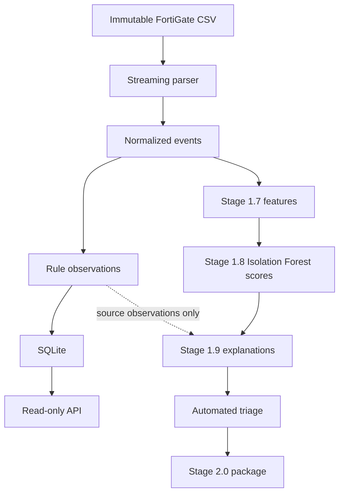
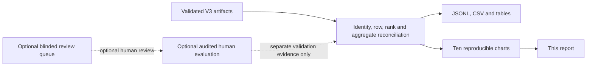

# Security Log Intelligence — Final Stage 2.0 Results

Status: **local portfolio package generated from validated Stage 1.9 V3 artifacts**.

## Problem and Dataset

This package presents reproducible anomaly, explanation, and investigation-priority outputs for 100,000 sanitized FortiGate records. Sanitized identifiers remain opaque, and raw data remains immutable.

## Data Limitations and Interpretation Boundaries

**ANOMALY != ATTACK.** An anomaly score is relative abnormality, not attack probability. HIGH_INTEREST is investigation priority, not confirmed attack; LOW_INTEREST is not confirmed benign. Suspected behaviors and source-product observations are descriptive evidence, not confirmed malicious activity.

## KPI Summary

- Total records: **100,000** (REFERENCE 79,947; HOLDOUT 20,053)
- Top-50 anomaly records: **50**
- HIGH_INTEREST / MEDIUM_INTEREST / LOW_INTEREST: **50 / 5,183 / 94,767**
- Explanation coverage: **15,141 (15.141%)**; specific behavior: **15,123**; Top-50 fallback: **18**
- Anomaly-score quantiles (min / p50 / p95 / max): **0.231403 / 50.404643 / 95.248102 / 100.0**
- Investigation-priority quantiles (min / p50 / p95 / max): **0.208263 / 45.364179 / 85.723292 / 99.995497**

## Architecture



## Workflow



## Rule Baseline

Existing Stage 1.4 rule observations are preserved as reference context. They are not labels, training features, or confirmed attacks.

## Feature Engineering

Stage 1.7 supplies the frozen, audited feature artifact. Raw identifiers, timestamps, finding values, threat fields, and source-product decisions are excluded from the feature input.

## Leakage Controls

Reference and holdout partitions remain frozen. Stage 1.4 rule and source observations are explanation context only and never model features or attack labels.

## Model

Stage 1.8 uses the frozen Isolation Forest configuration recorded in the audited model metadata. This package does not retrain, rescore, or rerank the model output.

## Anomaly Scoring

Anomaly scores are relative abnormality scores on a 0–100 display scale, not attack probabilities. The frozen Stage 1.8 rank is deterministic and remains the authoritative anomaly order.

## Explanation Method

Stage 1.9 supplies evidence-based driver reasons and reference context. Reasons describe observed relationships to the audited reference population; they do not establish maliciousness or incident truth.

## Suspected Behavior and Attack Boundaries

Suspected behavior and attack-type fields are cautious investigation aids. They are not confirmed malicious behavior, confirmed attacks, or labels for supervised attack classification.

## Automated Triage and Optional Human Evaluation Methodology

Auto-triage prioritizes investigation only. The blinded-review queue is optional; no human labels were provided. PENDING rows are valid queue state, and absent human ground truth makes supervised attack-classification metrics unavailable.

## Results/Metrics/Graphs

All reported counts, percentages, tables, and chart aggregates are computed from the validated Stage 1.9 V3 inputs and reconciled final rows.

## Results Tables

Machine-readable exports: [final JSONL](../data/processed/stage_2_0_v5/final_anomaly_findings.jsonl), [final CSV](../data/processed/stage_2_0_v5/final_anomaly_findings.csv), [summary](../data/processed/stage_2_0_v5/analysis_summary.json), and [all tables](../data/processed/stage_2_0_v5/tables/).

### Auto-Triage Distribution

| Category | Count | Share of all records |
|---|---:|---:|
| HIGH_INTEREST | 50 | 0.050% |
| MEDIUM_INTEREST | 5,183 | 5.183% |
| LOW_INTEREST | 94,767 | 94.767% |

### Anomaly-Band Distribution

| Category | Count | Share of all records |
|---|---:|---:|
| TOP_0_1_PERCENT | 94 | 0.094% |
| TOP_1_PERCENT | 880 | 0.880% |
| TOP_5_PERCENT | 4,259 | 4.259% |
| BASELINE | 94,767 | 94.767% |

### Evidence-Strength Distribution

| Category | Count | Share of all records |
|---|---:|---:|
| HIGH | 0 | 0.000% |
| MEDIUM | 0 | 0.000% |
| LOW | 32 | 0.032% |
| No value | 99,968 | 99.968% |

### Suspected-Behavior Distribution

| Category | Count | Share of all records |
|---|---:|---:|
| UNUSUAL_TRAFFIC_VOLUME | 2,480 | 2.480% |
| UNUSUAL_TRAFFIC_DIRECTION | 1,484 | 1.484% |
| UNUSUAL_SESSION_CHARACTERISTICS | 3,610 | 3.610% |
| RARE_PORT_OR_SERVICE_CONTEXT | 11,533 | 11.533% |
| UNUSUAL_PROTOCOL_CONTEXT | 0 | 0.000% |
| UNCLASSIFIED_ANOMALOUS_PATTERN | 18 | 0.018% |

### Suspected-Attack Interpretation Distribution

| Category | Count | Share of all records |
|---|---:|---:|
| Possible reconnaissance activity | 0 | 0.000% |
| Unclassified suspicious behavior | 50 | 0.050% |
| No value | 99,950 | 99.950% |

### Review-Status Distribution

| Category | Count | Share of all records |
|---|---:|---:|
| NOT_SELECTED | 99,900 | 99.900% |
| PENDING | 100 | 0.100% |
| REVIEWED_RESOLVED | 0 | 0.000% |
| REVIEWED_UNCERTAIN | 0 | 0.000% |

## Visualizations

The zero-count reconnaissance category is retained intentionally. Chart percentages use the stated record-group denominator; driver tags can overlap and therefore do not sum to 100%.

### 01_score_distribution.png


Score distribution by partition; scores are relative abnormality, not probabilities.

### 02_top20_scores.png


Top-20 rank inspection; raw abnormality is annotated where rounded scores tie.

### 03_anomaly_bands.png


Frozen Stage 1.8 anomaly-band distribution.

### 04_protocol_representation.png


Source-assigned protocol shares for rank ≤ 1,000 versus remaining records.

### 05_service_representation.png


Source-assigned service shares for rank ≤ 1,000 versus remaining records.

### 06_observed_anomaly_driver_frequency.png


Complete suspected-behavior record shares for Top-50 and Top-1,000 records.

### 07_auto_triage_distribution.png


Automated investigation-priority distribution, not attack classification.

### 08_evidence_strength.png


Evidence-strength distribution, not attack probability.

### 09_suspected_attack_interpretation.png


Cautious source-supported interpretation distribution; not confirmed attacks.

### 10_feature_comparison.png


Stage 1.7 feature empirical CDFs for rank ≤ 100 versus remaining records; missing operands excluded.

## Top-50 Investigation Results

The [ranked Top-50 table](../data/processed/stage_2_0_v5/tables/top_50_anomalies.csv) contains exactly 50 unique source records, all HIGH_INTEREST. Its rank, source identity, score, evidence, and explanation context are preserved for investigation; this selection does not establish confirmed attacks.

## Four Case Studies

### Case 1 — TOP50_WITH_RULE_OBSERVATION

Requested category: `TOP50_WITH_RULE_OBSERVATION`. Fallback: `none`.

- Source: `5551` / `LOG_98b81214139c`; anomaly rank `5`, investigation rank `1`
- Scores: anomaly `99.994997`, investigation priority `99.995497`; band `TOP_0_1_PERCENT`, triage `HIGH_INTEREST`
- Behaviors: `UNCLASSIFIED_ANOMALOUS_PATTERN`; suspected attack interpretation: `Unclassified suspicious behavior`; evidence strength: `none`
- Rule/source observations: rule IDs `fortigate.anomaly_subtype_observation, fortigate.source_threat_observation`; source threat type `Reconnaissance`
- Review: `PENDING`; analyst and contextual labels remain `None` / `None`
- Evidence: duration: absent in this record; reference absence frequency 616/79947; descriptive extremeness 0.992295; protocol_icmp: observed 1.0; reference frequency 22066/79947; descriptive extremeness 0.723992
- Interpretation limit: this is an investigation example, not a confirmed incident or attack.

### Case 2 — TOP50_WITHOUT_RULE_OBSERVATION

Requested category: `TOP50_WITHOUT_RULE_OBSERVATION`. Fallback: `none`.

- Source: `6651` / `LOG_2cb8e00c2e4f`; anomaly rank `1`, investigation rank `23`
- Scores: anomaly `100.0`, investigation priority `90.0`; band `TOP_0_1_PERCENT`, triage `HIGH_INTEREST`
- Behaviors: `RARE_PORT_OR_SERVICE_CONTEXT`; suspected attack interpretation: `Unclassified suspicious behavior`; evidence strength: `LOW`
- Rule/source observations: rule IDs `none`; source threat type `none`
- Review: `PENDING`; analyst and contextual labels remain `None` / `None`
- Evidence: service_rarity: observed in 4/79947 reference records of this protocol; descriptive extremeness 0.998974; duration: absent in this record; reference absence frequency 616/79947; descriptive extremeness 0.992295; protocol_icmp: observed 1.0; reference frequency 22066/79947; descriptive extremeness 0.723992
- Interpretation limit: this is an investigation example, not a confirmed incident or attack.

### Case 3 — REFERENCE_OBSERVATION_OUTSIDE_TOP50

Requested category: `REFERENCE_OBSERVATION_OUTSIDE_TOP50`. Fallback: `none`.

- Source: `151` / `LOG_0648ef75cfa3`; anomaly rank `290`, investigation rank `19`
- Scores: anomaly `99.696049`, investigation priority `99.726444`; band `TOP_1_PERCENT`, triage `MEDIUM_INTEREST`
- Behaviors: `UNUSUAL_TRAFFIC_VOLUME, UNUSUAL_SESSION_CHARACTERISTICS, RARE_PORT_OR_SERVICE_CONTEXT`; suspected attack interpretation: `none`; evidence strength: `none`
- Rule/source observations: rule IDs `fortigate.source_threat_observation`; source threat type `Reconnaissance`
- Review: `NOT_SELECTED`; analyst and contextual labels remain `None` / `None`
- Evidence: log_duration: observed 10.299407247800762; higher relative to 79331 eligible reference records; descriptive extremeness 0.997365; service_rarity: observed in 79/79947 reference records of this protocol; descriptive extremeness 0.996335; log_sent_packets: observed 12.945514020774835; higher relative to 79331 eligible reference records; descriptive extremeness 0.964793
- Interpretation limit: this is an investigation example, not a confirmed incident or attack.

### Case 4 — MEDIUM_INTEREST_SPECIFIC_BEHAVIOR

Requested category: `MEDIUM_INTEREST_SPECIFIC_BEHAVIOR`. Fallback: `none`.

- Source: `40361` / `LOG_25d8b6388df5`; anomaly rank `51`, investigation rank `55`
- Scores: anomaly `99.959973`, investigation priority `89.963976`; band `TOP_0_1_PERCENT`, triage `MEDIUM_INTEREST`
- Behaviors: `RARE_PORT_OR_SERVICE_CONTEXT`; suspected attack interpretation: `none`; evidence strength: `none`
- Rule/source observations: rule IDs `none`; source threat type `none`
- Review: `NOT_SELECTED`; analyst and contextual labels remain `None` / `None`
- Evidence: dst_port_rarity: observed in 0/57881 reference records of this protocol; descriptive extremeness 1.000000; protocol_udp: observed 1.0; reference frequency 4893/79947; descriptive extremeness 0.938797; log_sent_bytes: observed 0.0; lower relative to 79331 eligible reference records; descriptive extremeness 0.532100
- Interpretation limit: this is an investigation example, not a confirmed incident or attack.

## Optional Human Evaluation

Human review is optional. No human labels were supplied, so supervised attack-classification metrics, reference agreement, precision, recall, F1, ROC-AUC, PR-AUC, and confusion matrices are unavailable and are not inferred.

## Reproducibility

The validated release package is `data/processed/stage_2_0_v5`; preserve it.
The package accepts validated Stage 1.9 V3 artifacts only; superseded V2
artifacts are not inputs. Run each command from the repository root only after
its predecessor exits with code 0. These commands build a distinct fresh
reproduction package rather than overwriting the validated V5 package.

```powershell
& .\.venv\Scripts\python.exe -m pip check
& .\.venv\Scripts\python.exe -m unittest discover -s tests -p "test_*.py" -v
& .\.venv\Scripts\python.exe -m pytest tests -q
$AuditedStage19Explanations = '.\data\processed\stage_1_9_corrected_v3'
$AuditedStage19AutoTriage = '.\data\processed\stage_1_9_auto_triage_corrected_v3'
$Stage20Output = '.\data\processed\stage_2_0_reproduction'

if (Test-Path -LiteralPath $Stage20Output) {
    throw "Fresh Stage 2.0 reproduction output path already exists"
}

& .\.venv\Scripts\python.exe .\src\build_final_package.py --features-dir .\data\processed\stage_1_7 --scores-dir .\data\processed\stage_1_8 --explanations-dir $AuditedStage19Explanations --auto-triage-dir $AuditedStage19AutoTriage --output-dir $Stage20Output
.\scripts\validate_stage_2_0.ps1 -PackageDir $Stage20Output
.\scripts\validate_stage_1_6.ps1 -Database .\data\processed\stage_1_5f_detection_store.sqlite3 -FindingsInput .\data\processed\stage_1_4f_detection_findings.jsonl -SummaryInput .\data\processed\stage_1_4f_detection_summary.json -ExpectedRunId 5212f083bb3832158bcd650535536c22d1b8dbf582496726f998ece949ee20dc -Port 8000
```

## Local Demo

Open this report and the ranked CSV, then trace a case through its preserved source identity and explanation context. The existing read-only API serves Stage 1.4 rule observations only; it does not serve AI outputs.

```powershell
& .\.venv\Scripts\python.exe .\src\serve_api.py --database .\data\processed\stage_1_5f_detection_store.sqlite3 --findings .\data\processed\stage_1_4f_detection_findings.jsonl --summary .\data\processed\stage_1_4f_detection_summary.json --expected-run-id 5212f083bb3832158bcd650535536c22d1b8dbf582496726f998ece949ee20dc --port 8000
```

In a second local terminal:

```powershell
Invoke-RestMethod http://127.0.0.1:8000/healthz
Invoke-RestMethod "http://127.0.0.1:8000/api/v1/runs/5212f083bb3832158bcd650535536c22d1b8dbf582496726f998ece949ee20dc/findings?limit=5"
```

Repository-supported Stage 1.6F evidence records a corrected loopback validation PASS for this exact store and approved Stage 1.4 artifacts: 43 findings across 25 source records, 227 evidence entries, and two rules. Rerun the command above for fresh local confirmation; it remains a read-only rule-observation API, not an AI-results API.

## Limitations

Timestamps and duration units are not reinterpreted. Sanitized network identifiers are opaque. No raw label data, confirmed attacks, or supervised evaluation is present.

## Future Work

Future work requires a separately approved, audited human-review workflow rather than automatically treating anomalies as attacks.
