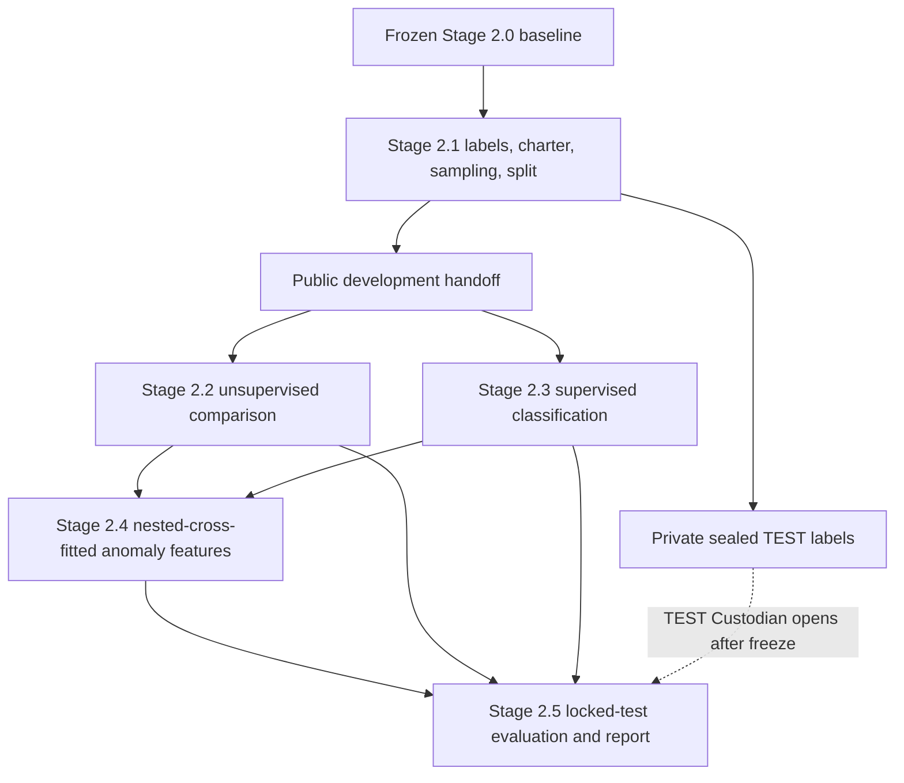

# Stage 2.1–2.5 Master ML Development Pipeline Plan

## 1. Plan Metadata

**PLAN STATUS:** APPROVED — TWO-BRANCH BENCHMARK ARCHITECTURE RE-APPROVED

**Plan type:** Cross-stage development specification

**Original master approval:** Explicitly provided on 2026-09-25 after final
focused review; preserved as approval history

**Two-Branch Benchmark Architecture Amendment approval:** Explicitly
re-approved by the human on 2026-09-27 after focused architecture review;
dataset separation, benchmark TEST independence, stage/model ownership,
evaluation/claim language, required model evaluation, and active architecture
consistency all passed with no surviving contradiction

**Execution authority:** The original master remains approved history. The
two-branch amendment is explicitly human re-approved and is the current active
architecture; each later detailed stage plan still requires its own approval
before execution.

**Repository:** `security-log-intelligence`

**Repository root:** `/Users/tanawat/Projects/security-log-intelligence`

**Planning baseline:** `b81816f0cd02bff8c1c2f08f839ffc7cafc35cf5`

**Baseline message:** `Complete Stage 2.0 final project package`

**Baseline branch:** `main`

**Pipeline scope:** Stage 2.1 through Stage 2.5

**Document date:** 2026-09-27

**Plan version:** `2.0-two-branch-benchmark-architecture-amendment`

**Current amendment ID:**
`S2.1-2.5-AMEND-2026-09-27-TWO-BRANCH-BENCHMARK-V1`

This document is the authoritative cross-stage contract for future detailed
Stage 2.1–2.5 plans. It is not an implementation plan for any single stage,
does not authorize model execution, and is not a substitute for the five
detailed stage plans. A later plan may add implementation detail but must not
silently change decisions owned here or by an approved earlier stage.

## 2. Purpose

Define one coherent, leakage-controlled, two-branch ML pipeline that extends
the frozen Stage 2.0 portfolio baseline while keeping real-log investigation
and labeled benchmark evaluation methodologically separate:

- **Branch A — Real FortiGate logs:** the existing Isolation Forest
  methodology, one second defensible unsupervised anomaly model, anomaly
  scoring, explainability, and prioritization as a real-log security case
  study; and
- **Branch B — UNSW-NB15 labeled benchmark:** U1/U2 benchmark evaluation, one
  interpretable supervised classifier, one capability-gated stronger tabular
  classifier, and paired supervised/chained comparisons using leakage-safe
  anomaly signals.

The pipeline must make dataset identity, label provenance, sampling, data
splits, feature state, model selection, test isolation, artifact lineage, and
interpretation limits auditable. FortiGate and UNSW-NB15 are never concatenated
or represented as one domain. The completed FortiGate label-feasibility study
is retained as an honest negative result rather than expanded with fabricated
ground truth.

## 2A. Active Two-Branch Benchmark Architecture Amendment

This section is the sole current architecture authority for Stages 2.1–2.5.
It supersedes every retained single-dataset assumption that would use
FortiGate proxy labels for supervised fitting, supervised model selection,
chained ML, or primary quantitative attack/benign evaluation. Cross-cutting
safety rules retained below—immutability, provenance, no-overwrite
publication, split/fold isolation, TEST locking, leakage prevention,
determinism, and honest claims—remain binding when they are compatible with
this section. If retained text conflicts, this section controls.

### Branch A — Real FortiGate logs

Branch A is the real-world anomaly-detection and security-log case study. It
uses the existing FortiGate ingestion/normalization pipeline, the frozen
Stage 1.7 36-feature definition with branch-local fitted state, U1 Isolation
Forest, the Stage 2.2 U2 unsupervised model when it passes, anomaly scoring,
explainability, investigation prioritization, and evidence-bounded qualitative
analysis.

FortiGate is not an active source for primary supervised ATTACK/BENIGN fitting,
validation, TEST metrics, or chained ML. No Stage 2.3 or Stage 2.4 model may
consume FortiGate proxy labels. A future independently justified FortiGate
label program would require a new human-approved master amendment; it cannot be
inferred from this history.

The completed precision-first label-feasibility study is frozen as:

| FortiGate cohort | ATTACK | BENIGN | UNCERTAIN |
|---|---:|---:|---:|
| TRAIN | 18 | 0 | 67,984 |
| VALIDATION | 0 | 12 | 15,988 |

`CANONICAL_FORTIGATE_SUPERVISED_LABELS = NOT_PUBLISHED`.

The binding conclusion is: **FortiGate labels were insufficient for
defensible supervised classification, so the project does not fabricate
additional ground truth.** These counts are feasibility evidence, not model
performance, prevalence, or a released supervised target. The AI proxy,
deterministic proxy, and precision-first proxy approaches remain immutable
history under `HISTORICAL / LABEL-FEASIBILITY STUDY`; none is an active
label-generation path.

### Branch B — UNSW-NB15 labeled benchmark

Branch B is the quantitative labeled ML benchmark. Its primary binary target
is exactly `NORMAL` versus `ATTACK`. The original attack category is preserved
as a separate non-feature field for secondary category-level analysis and is
never collapsed, overwritten, or used as an input feature.

Branch B owns:

- U1 Isolation Forest benchmark evaluation;
- U2 benchmark evaluation after Stage 2.2 capability/feasibility selection;
- S1 interpretable supervised classification, with Logistic Regression the
  expected candidate rather than an automatic final choice;
- S2 stronger tabular supervised classification selected by an approved
  capability gate, not solely by a higher observed score;
- leakage-safe chained S1/S2 variants using U1 and conditional U2 scores;
- confusion matrices, accuracy, precision, recall, F1, ROC-AUC, and PR-AUC;
  and
- the primary baseline-versus-chain quantitative comparison.

UNSW-NB15 acquisition is not performed by this plan amendment. Before any
download, the Stage 2.1 execution plan must freeze an approved source,
license/usage record, expected file inventory, checksum procedure, raw-data
location, immutable acquisition manifest, and failure policy. Unknown or
changed source identity blocks ingestion.

### Strict dataset separation

FortiGate and UNSW-NB15 must never be concatenated into one training,
validation, TEST, feature, or scoring table. They retain separate:

- raw and processed roots;
- acquisition and source manifests;
- adapters and normalized schemas;
- feature definitions and feature-state manifests;
- preprocessing, imputation, encoding, scaling, selection, and calibration
  state;
- split/fold definitions and random seeds;
- models, thresholds, predictions, metrics, and bundles; and
- provenance, validation, and report namespaces.

Every artifact identity includes `dataset_id` and `branch_id`. A loader must
reject mixed dataset IDs, cross-branch rows, unexpected files, and an artifact
whose parent manifest belongs to the other branch. FortiGate keeps its existing
36-feature contract. UNSW-NB15 receives a benchmark-specific feature contract
derived from its verified source schema; it must not be forced into, padded to,
or semantically mapped onto the FortiGate 36-feature schema.

### UNSW-NB15 split, TEST, and leakage contract

The official UNSW-NB15 TEST split is preserved as the final benchmark
evaluation population. No row may move from official TEST into development,
and no model, threshold, feature choice, preprocessing decision, stopping rule,
or report headline may be tuned with official TEST labels or results.

Only the official training split may produce TRAIN/VALIDATION membership and
development folds. Stage 2.1 freezes a deterministic derivation before model
fitting, including seed/namespace, target stratification where appropriate,
duplicate/group policy, validation purpose, and exact membership manifest.
Stage 2.3 owns the downstream outer folds over official-training-derived TRAIN;
Stage 2.4 consumes those folds unchanged and creates only nested inner folds.

Before modeling, Stage 2.1 must:

1. verify the official train/test file identities, source schema, binary label
   semantics, attack-category semantics, row counts, and parsing rules from the
   acquired artifacts rather than assumed memory;
2. audit exact duplicates, target-conflicting duplicates, near duplicates,
   stable entity/flow identifiers, and any cross-official-split overlap;
3. keep the official TEST membership intact and publish both the required
   official-TEST result and a predeclared duplicate-excluded sensitivity result
   if cross-split duplicate overlap exists; no row is silently deleted or moved;
4. exclude the binary target, attack category, target-derived fields,
   post-outcome fields, row/split identifiers, and any trivially reconstructive
   proxy from model features through a target-leakage manifest;
5. freeze a benchmark-specific feature contract and explicit feature allowlist;
6. fit preprocessing only on the applicable TRAIN or fold-local partition;
7. quarantine official TEST labels from Stage 2.2–2.4 model-selection code,
   expose test features only through a purpose allowlist, and bind the locked
   test identity by manifest/hash before tuning; and
8. require deterministic replay, no-overwrite publication, and independent
   leakage/split validation before Stage 2.2 starts.

The primary official-TEST result remains comparable to the named benchmark
split. Any required duplicate-excluded sensitivity result is separately named
and cannot silently replace or be pooled with the official-TEST result.

### Models and chained ML

`U1 = Isolation Forest`. `U2` is the second unsupervised family selected in
Stage 2.2 under a bounded approved capability, reproducibility, resource, and
out-of-sample gate. Fits, preprocessing, thresholds, and outputs are
branch-specific even when the U1/U2 family is shared. U1/U2 model fitting is
label-blind. UNSW labels may be used only by the frozen development-evaluation
and threshold-selection policy on official-training-derived validation data;
they never enter U1/U2 fitting, and official TEST labels never select a model
or threshold. `ANOMALY != ATTACK` remains mandatory.

`S1` is the interpretable benchmark classifier; Logistic Regression is the
expected candidate. `S2` is a stronger tabular benchmark classifier selected
only after its approved capability and feasibility gate. S2 is not
predetermined merely to maximize benchmark scores.

Chained ML runs on UNSW-NB15 only:

```text
benchmark-specific base features
    + leakage-safe U1 score
    + U2 score only when U2 passes
    -> S1 / S2
```

The previously approved nested cross-fitting invariant remains binding.
For every downstream outer-validation row, all U1/U2 training signals and
their preprocessing/state are produced without that row or its protected
group. Global anomaly scores or state fitted with outer-validation, VALIDATION,
or official TEST data are forbidden. Baseline and chained candidates use the
same eligible benchmark rows, targets, outer folds, base allowlist, and
comparable selection budget.

### Active stage ownership

| Stage | Sole active responsibility | Explicit non-responsibility |
|---|---|---|
| **2.1** | Close and preserve the FortiGate label-feasibility result; define the UNSW-NB15 acquisition, schema/adapter, binary/attack-category target, official split, deterministic TRAIN/VALIDATION, TEST lock, duplicate/leakage, benchmark-feature, and handoff contracts. | Does not download UNSW-NB15 under this amendment, train a model, publish FortiGate canonical labels, or compute benchmark metrics. |
| **2.2** | Fit/evaluate U1 and select/fit U2 separately on the FortiGate real-log branch and UNSW benchmark branch; own branch-specific unsupervised preprocessing, scores, thresholds, explainability, and status. | Does not train S1/S2, merge branches, tune on official TEST, or create chained features. |
| **2.3** | Train/select S1 and capability-gated S2 on UNSW-NB15 only; own benchmark supervised allowlist, downstream outer folds, preprocessing/calibration, thresholds, baseline predictions, and frozen official-TEST predictions. | Does not use FortiGate labels, redefine official splits, or build chained models. |
| **2.4** | Run UNSW-NB15-only chained S1/S2 experiments with nested cross-fitting and frozen Stage 2.3 outer folds; own chain selection and paired baseline/chain predictions. | Does not chain FortiGate, resplit data, or generate global leakage-prone anomaly features. |
| **2.5** | Perform final branch-separated evaluation/reporting: FortiGate real-log findings; UNSW quantitative metrics; four primary matrices; paired baseline-versus-chain results; and domain-transfer limitations. | Does not retune models, pool datasets/metrics, or translate UNSW scores into FortiGate performance claims. |

### Four primary confusion matrices and reporting boundary

Stage 2.5 reserves four primary UNSW-NB15 `NORMAL`/`ATTACK` confusion
matrices, in this order:

1. U1 Isolation Forest;
2. U2;
3. S1; and
4. S2.

U1/U2 matrices compare frozen anomaly/inlier decisions with benchmark labels;
they must explicitly retain `ANOMALY != ATTACK`. Every threshold is frozen
from official-training-derived TRAIN/VALIDATION only. Official TEST never
selects a threshold. If U2 or S2 fails its approved gate, its reserved matrix
is reported `UNAVAILABLE` with the gate reason rather than replaced by an
unapproved model. Chained confusion matrices are additional and never replace
the four reserved baseline matrices.

Allowed claim: **“F1 = X on the UNSW-NB15 benchmark.”**

Prohibited claim: **“FortiGate attack-detection F1 = X”** unless a future
independently approved FortiGate label program supplies defensible labels.
Every final benchmark section must state exactly:

```text
Benchmark performance does not prove identical performance on the real FortiGate environment.
```

No metric, matrix, model winner, or target value is assumed in advance.

### Historical-scope rule

The retained single-dataset label/sampling/TEST architecture in Sections
5–31 documents prior approved reasoning and the completed FortiGate
label-feasibility study. It is `HISTORICAL / LABEL-FEASIBILITY STUDY` wherever
it conflicts with this section. In particular, its FortiGate S1/S2,
proxy-reference TEST, and FortiGate chained contracts have no current execution
authority. This amendment preserves that history; it does not delete or
rewrite it as though it never existed.

## 3. Frozen Baseline

The v1.0 baseline at commit `b81816f` is complete and immutable for this work.
Stage 2.1–2.5 extends it; no stage may rewrite validated Stage 1.7–2.0 artifacts
in place.

The frozen baseline establishes:

- 100,000 sanitized FortiGate records and immutable raw/source evidence;
- a normalized input with SHA-256
  `c195c6322665530d56f1bd5390b6b1c20728881a21ee36352c7c46e0a7138976`;
- the ordered 36-feature Stage 1.7 definition and its historical
  REFERENCE/HOLDOUT artifact;
- the historical Stage 1.8 Isolation Forest configuration, score semantics,
  ranks, bands, and Top-50 review budget;
- Stage 1.9 explanations, auto-triage, and a blinded review-queue mechanism;
- Stage 2.0 V5 reports and local ignored artifacts; and
- strict interpretation boundaries around anomaly, rules, source observations,
  investigation priority, and absent human ground truth.

Historical artifacts remain valid for their original purpose. They are not
automatically valid as training or evaluation artifacts under the new
Stage 2.1 train/validation/test design.

### Baseline conflict resolution

`AGENTS.md` still describes Stage 1 as current, and the historical Stage 2.0
plan says no Stage 2.1+ work is introduced. Current explicit human instruction
and the frozen completed repository state supersede those historical roadmap
statements. Their safety, evidence, reproducibility, and interpretation rules
remain binding.

## 4. Repository Evidence Reviewed

The plan is grounded in the repository at `main` / `b81816f`, not only in chat
context.

| Evidence | Verified planning fact |
|---|---|
| `AGENTS.md` and `/Users/tanawat/.codex/RTK.md` | Raw-data immutability, opaque identifier handling, contextual missingness, duplicate caution, reproducibility, honest evaluation, and no fabricated evidence remain required. |
| `README.md` | Stage 2.0 V5 is the current completed project state. The existing anomaly score is relative abnormality, not attack probability. |
| `docs/final_project_report.md` | Final package covers 100,000 rows, 79,947 REFERENCE and 20,053 HOLDOUT rows, 36 features, 50 Top-50 records, no human labels, and no supervised metrics. |
| `docs/plans/stage_1_7_ai_feature_engineering_plan.md` and `docs/stage_1_7_feature_findings.md` | Stage 1.7 defines one record per observation, session-grouped 80/20 REFERENCE/HOLDOUT assignment, three reference-derived rarity features, and a fixed ordered 36-feature contract. HOLDOUT is descriptive, not a labeled test set. |
| `src/ai_features/` and `tests/test_ai_features.py` | Feature code confirms exact feature order, reference-only rarity maps, finite fallback values with separate missingness flags, and no scaling. |
| `docs/plans/stage_1_8_anomaly_detection_scoring_plan.md` and `docs/stage_1_8_anomaly_findings.md` | Isolation Forest fits only historical REFERENCE rows. It emits continuous scores, reference percentiles, ranks, bands, and a Top-50 review selection. These are not attack decisions. |
| `src/anomaly/` and `tests/test_anomaly.py` | Historical model configuration and score direction are explicit and reproducible. Stage 1.8 input is tightly bound to the historical Stage 1.7 artifact. |
| `docs/plans/stage_1_9_explainability_evaluation_plan.md`, `docs/stage_1_9_evaluation_findings.md`, `src/evaluation/`, and related tests | Existing review values are `SUSPICIOUS`, `NOT_SUSPICIOUS`, and `UNCERTAIN`; they are optional review judgments, not ATTACK/BENIGN ground truth. Current queue has 100 rows and no completed human labels. |
| `docs/plans/stage_2_0_final_project_package_plan.md`, `src/build_final_package.py`, and `tests/test_final_package.py` | Stage 2.0 copies frozen upstream semantics, validates hashes, refuses overwrite, and reports no supervised metrics without human evidence. |
| Local ignored metadata under `data/processed/` | Stage 1.7 feature SHA-256 is `1a147b23...85fb1`; Stage 1.8 score SHA-256 is `f98188b6...e8c4`; Stage 1.8 manifest SHA-256 is `9c00081f...be77`; Stage 1.9 V3 and Stage 2.0 V5 artifacts exist locally and are ignored by Git. |
| `.gitignore` and `git status --short` | Generated data is local and ignored. Pre-existing untracked `.DS_Store` and `data/` entries are unrelated to this plan and must remain untouched. |
| Stage 1.2 timestamp findings and normalization contracts | `itime` epoch meaning remains unverified; file order is not chronological; `data_timestamp` semantics are unknown. A time-aware split is not currently justified. |

### Planning observations

1. The 36-feature **definition** is reusable. The historical feature **artifact**
   is bound to Stage 1.7 REFERENCE rarity maps and cannot be reused blindly for
   a new supervised split.
2. The historical Isolation Forest artifact must remain preserved. A fair
   Stage 2.x comparison requires a versioned refit of the same locked baseline
   methodology using only the new authoritative training population.
3. Existing Stage 1.9 review infrastructure is useful design precedent, but its
   queue is anomaly-enriched and its review taxonomy is not an ATTACK/BENIGN
   label contract.
4. Current timestamp evidence does not support chronological train/test claims.
5. The Stage 1.8 artifact metadata records build-time deterministic state, while
   the findings document records the later external validator pass. Future
   manifests must preserve both artifact identity and external validation
   evidence without rewriting the frozen artifact.

## 5. Historical Single-Dataset Target State — Superseded

The completed Stage 2.1–2.5 pipeline must provide:

1. A versioned reference-label system with `ATTACK`, `BENIGN`, and `UNCERTAIN`,
   full provenance, immutable history, and explicit primary-evaluation
   eligibility.
2. Frozen, non-overlapping review designs: enriched TRAIN review, one
   interpretable VALIDATION selection design, and representative independent
   TEST review.
3. One authoritative group-aware train/validation/test split manifest created
   before model fitting and test-label access.
4. A Stage 2.1 evaluation charter and shared transformation protocol frozen
   before model development.
5. Split-safe regeneration of the 36-feature definition, including train-only,
   outer-fold-local, and inner-fold-local population-derived state.
6. One required unsupervised score producer, the locked Isolation Forest
   baseline methodology, plus a second model only when it passes its gate.
7. Up to two supervised classifiers: an interpretable baseline and a stronger
   tabular model only when the label sufficiency gate passes.
8. A predeclared conditional chained experiment using U1 alone or U1 plus U2,
   implemented with nested cross-fitting during downstream selection.
9. Frozen selection criteria, validation-use budget, thresholds, and model
   choices before TEST prediction generation.
10. Physically isolated TEST labels controlled by a human TEST Custodian and
   opened once only after all prediction identities are frozen.
11. One Stage 2.5 test opening, followed by reconciled metrics, matrices,
   curves, paired baseline-versus-chain comparisons, and an evidence-bounded
   report.
12. A complete provenance path from normalized source identity through labels,
    split, features, models, predictions, metrics, and report statements.

No target metric value or model winner is assumed.

## 6. Historical Single-Dataset Cross-Stage Architecture — Superseded



### Authoritative flow

```text
Frozen normalized records and historical context
    -> Stage 2.1 annotation contract, sampling frame, and review
    -> immutable development label history plus private TEST label history
    -> evaluation charter, authoritative split, transformation protocol,
       public handoff, and private TEST seal
    -> split-safe and fold-safe feature generation
    -> Stage 2.2 unsupervised models and label-free test predictions
    -> Stage 2.3 supervised baselines and label-free test predictions
    -> Stage 2.4 nested-cross-fitted anomaly features and chained predictions
    -> TEST Custodian authorization
    -> Stage 2.5 one-time test-label join, metrics, comparison, report
```

### Pipeline-wide invariants

- TEST identities may be known so they can be excluded from fitting; TEST
  labels, label-derived metadata, and class distribution remain physically and
  logically inaccessible through Stage 2.4.
- Stage 2.2–2.4 may read only an explicit public-handoff allowlist. Discovery of
  a private TEST artifact or label-derived TEST summary fails the stage closed.
- Primary annotation is independent of model- and pipeline-derived outputs;
  detector-derived evidence remains a distinguishable weaker provenance tier.
- Stage 2.1 freezes the evaluation estimand, primary comparison, selection
  rules, validation-use budget, weighting, uncertainty, multiplicity, and
  test-opening policy before model development.
- Every test prediction is generated after model/configuration/threshold
  choices are frozen and before test labels are opened.
- Before TEST opening, only automated structural checks may inspect TEST
  prediction artifacts; content-level inspection is prohibited.
- All paired comparisons use the same eligible test rows and label version.
- `UNCERTAIN` remains a valid label and is excluded from binary denominators.
- Historical scores, rules, threat observations, triage values, and reviewer
  decisions are never silently converted into ground truth.
- Downstream chained selection uses nested cross-fitting. Every learned state
  obeys the applicable outer and inner fold boundary.
- Later stages consume authoritative manifests; they do not create replacement
  splits, labels, sampling weights, evaluation rules, or feature definitions.

## 7. Historical Stage 2.1 FortiGate Labeling Role — Feasibility Study

### Objective

Create the evaluation foundation before model comparison. Stage 2.1 owns label
semantics, annotation unit, evidence-window policy, sampling and split design,
evaluation estimand and charter, provenance eligibility, shared transformation
protocol, TEST sealing/custodian contract, and sufficiency decisions.

### Inputs

- Frozen normalized input identity and source-record provenance.
- Stage 1.7 feature definitions and historical split metadata.
- Stage 1.8 scores/ranks/bands only as optional predeclared sampling context.
- Stage 1.4 derived rule results and Stage 1.9 explanation/triage context only
  as predeclared sampling context, never as evidence displayed to primary
  annotators.
- Raw FortiGate source-product threat fields/alerts only under the evidence
  rubric; if decisive without independent corroboration, they produce a weaker
  detector-derived proxy label.
- Stage 1.9 review protocol as design precedent, not as attack labels.
- Raw event evidence and independently sourced corroboration permitted by the
  approved annotation rubric.

### Process

1. Reconcile one 100,000-row sampling frame by normalized dataset identity,
   `source_record_number`, and `source_record_id`.
2. Build label-blind exact-duplicate, near-duplicate, session-group, and entity
   diagnostics before split assignment.
3. Define measurable group/entity feasibility, freeze the split algorithm, and
   assign every record to `TRAIN`, `VALIDATION`, or `TEST` at group level.
4. Freeze the annotation unit, observation unit, prediction point, permitted
   evidence window, temporal cutoff, propagation rules, entity/context rules,
   future-information prohibition, and conditions requiring `UNCERTAIN`.
5. Freeze the evaluation charter: primary population and estimand, eligible
   provenance, primary metric and comparison, model/threshold selection rules,
   weighting, validation-use and tuning budgets, deterministic tie-breaking,
   uncertainty unit, multiplicity, and TEST-opening/defect policies.
6. Freeze the shared pre-model transformation protocol used by Stages 2.2–2.4.
7. Draw an enriched TRAIN review sample, one separately defined VALIDATION
   sample, and a probability-based representative TEST sample. Predeclare all
   review phases, stopping rules, expansion rules, stratum allocations, and
   inclusion-probability updates before outcomes are observed.
8. Perform versioned primary review/adjudication blinded from all model- and
   pipeline-derived outputs, with explicit independent evidence, reviewer
   provenance, assistance disclosure, and retained `UNCERTAIN`.
9. Publish an allowlisted public development handoff. Place locked TEST labels
   and every label-derived TEST artifact in a distinct custodian-controlled
   private bundle that is not readable by Stages 2.2–2.4.
10. Measure disagreement, resolution status, class/group counts, inclusion
    probabilities, effective sample size, and model-specific sufficiency.
    Publish TRAIN/VALIDATION gate status only. Before Stage 2.5, expose only
    TEST seal/integrity state such as `SEALED`; keep every label-derived TEST
    gate result, class count, and sufficiency detail private.
11. Issue explicit `PASS`, `FAIL`, or `INSUFFICIENT` gates. Do not reinterpret
    insufficiency as a negative result.

### Outputs

- evaluation charter and shared transformation protocol;
- public development bundle containing development label history/projection,
  development review decisions, permitted provenance, public sampling and
  split metadata, duplicate/group/entity audit, non-revealing label/sufficiency
  summaries, TEST seal envelope, and public manifest;
- private sealed TEST bundle containing locked TEST labels, TEST review and
  adjudication history, private sampling metadata, label-derived TEST
  sufficiency detail, and a separate private manifest;
- separate TRAIN, VALIDATION, and TEST sampling-design records with phase,
  stratum, and probability fields; and
- explicit public `PASS`, `FAIL`, or `INSUFFICIENT` status for unsupervised
  development evaluation, S1, S2, and conditional chaining; the locked-TEST
  evaluation gate remains private until authorized Stage 2.5 opening.

### Validation

- Exact source identity reconciliation and one split per source row.
- No duplicate/near-duplicate/session group crosses a split.
- No VALIDATION or TEST row enters enriched TRAIN review sampling.
- Every representative TEST sample row has a known nonzero inclusion
  probability, including any valid multi-phase adjustment.
- Every accepted final label has valid provenance and an immutable review
  history.
- Primary labels satisfy the independent-evidence and blinding contract.
- AI-only and uncorroborated detector-derived proxy labels are absent from the
  primary eligible label projection.
- Public and private bundles have distinct physical paths and manifests.
- Public manifests, directory globs, consumer allowlists, and public
  sufficiency reports expose no TEST labels, class totals, label-derived TEST
  metadata, label-derived TEST gate status, or private artifact locations.
- A denied-access/fail-closed test proves Stages 2.2–2.4 cannot consume the
  private TEST bundle.
- Label sufficiency results are reproducible from frozen manifests.

### Contract for later stages

Stages 2.2–2.4 receive only allowlisted public artifacts: the evaluation
charter, shared transformation protocol, split/group contract, permitted
development labels and sampling metadata, eligibility rules, and a
non-revealing TEST seal identity. Their input loaders must reject unexpected
files and any TEST label or label-derived TEST field.

Only Stage 2.5 may receive the private bundle, and only after final model,
configuration, threshold, and prediction hashes are frozen; required
validation passes; the human TEST Custodian authorizes access; and the opening
event is logged. The TEST Custodian is independent from model-selection
execution and owns sealed-label access, opening authorization, the opening
audit, and prevention of premature exposure.

### Blockers

- provenance cannot distinguish human, external, and AI-only decisions;
- a primary label is influenced by prohibited model/pipeline-derived evidence
  or lacks independent support required by its provenance tier;
- representative TEST sample has zero-probability coverage gaps;
- sampling expansion is outcome-adaptive without valid predeclared combined
  inclusion probabilities;
- groups cannot be isolated without collapsing a required split;
- the evaluation charter, annotation/evidence contract, transformation
  protocol, public/private isolation, or TEST Custodian contract is unfrozen;
- class/group/effective-sample criteria fail for the intended next stage; or
- test-label isolation cannot be demonstrated.

## 8. Historical Single-Dataset Stage 2.2 Role — Superseded

### Objective

Preserve the historical Isolation Forest methodology as Model U1, select one
defensible Model U2, and compare continuous out-of-sample anomaly behavior
under the Stage 2.1 split without representing anomaly output as attack truth.

### Inputs

- Stage 2.1 allowlisted public split/group artifacts, permitted development
  labels, label eligibility, sampling weights, and non-revealing TEST seal.
- Frozen evaluation charter and shared transformation protocol.
- Frozen 36-feature definition and normalized input identity.
- Historical Stage 1.8 configuration and score semantics.

### Process

1. Regenerate Stage 1.7 feature definitions under the shared transformation
   protocol, with every learned state fitted only on permitted TRAIN data or
   the applicable development fold.
2. Refit Model U1 with the frozen historical Isolation Forest configuration;
   retain the original Stage 1.8 model/artifacts unchanged as historical
   evidence.
3. Evaluate a bounded second-model shortlist for out-of-sample scoring,
   runtime/memory feasibility near 100,000 by 36, deterministic controls, and
   compatibility with Stage 2.4 cross-fitting.
4. Select Model U2 using the evaluation-charter-conforming criterion, tuning
   budget, validation-use budget, and deterministic tie-breaker. A model that
   cannot score unseen rows is ineligible unless configured in a formally
   valid novelty/out-of-sample mode.
5. Record U2 as `PASS`, `UNAVAILABLE`, or `FAIL`. U1 remains required; absence
   of a valid U2 activates the predeclared U1-only Stage 2.4 branch rather than
   silently substituting an unapproved model.
6. Fit each permitted final unsupervised model on the same label-blind TRAIN
   population. Labels may assess validation behavior and threshold choice only
   as allowed by the charter and may not enter unsupervised fitting.
7. Convert model-specific raw outputs to a common direction where higher means
   more anomalous. Any empirical-percentile display transform uses TRAIN score
   distributions only.
8. Select anomaly/inlier thresholds using the charter's threshold policy and
   validation-use budget. Record whether the policy is label-free or
   validation-label-calibrated.
9. Freeze model choice/status, preprocessing, score transform, and thresholds
   before producing TEST scores and predictions without reading TEST labels.
   Before TEST opening, permit automated structural validation only; prohibit
   manual inspection of score distributions, ranks, alert volumes, class-like
   patterns, and individual prediction examples.

If eligible VALIDATION labels select U2 or its threshold, the result must be
described as an **unsupervised fit with validation-guided model/decision
selection**. A detailed Stage 2.2 plan may instead predeclare a fully label-free
selection rule, but it may not blur the distinction.

### Locked Model U1 configuration

The Stage 2.x Isolation Forest baseline retains:

```text
n_estimators=200
max_samples=4096
contamination="auto"
max_features=1.0
bootstrap=False
n_jobs=1
random_state=1729
warm_start=False
```

`contamination="auto"` does not define the pipeline's attack or operational
threshold. Stage 2.2 threshold metadata remains separate.

### Outputs

- Model U1 and any valid U2 artifacts plus trusted manifests;
- U2 selection rationale and explicit `PASS`, `UNAVAILABLE`, or `FAIL` status;
- continuous TRAIN/VALIDATION/TEST U1 scores and U2 scores when U2 passes,
  with common direction;
- validation-selected anomaly/inlier decisions;
- threshold and score-transform metadata;
- validation comparison results and diagnostics;
- label-free TEST predictions; and
- a reusable fit/score contract for Stage 2.4 cross-fitting.

### Validation

- TRAIN-only feature state and model fitting.
- When U2 passes, U1/U2 use the same row populations, feature contract, and
  comparison folds.
- Reproducible score direction and finite out-of-sample scores.
- No test-label access, test-derived threshold, or test-derived score scaling.
- No content-level inspection of TEST scores or predictions before opening.
- Any passing Model U2 proves resource feasibility on the approved data size.
- Selection criterion, validation use, search budget, and deterministic
  tie-breaker reconcile to the frozen evaluation charter.
- Clear text that anomaly/inlier is not ATTACK/BENIGN.

### Contract for later stages

Stage 2.4 consumes frozen U1 and conditional U2 fit recipes and score
transforms, not globally prefitted all-data scores. U2 status determines the
predeclared eligible chained branch. Stage 2.5 consumes frozen TEST scores,
thresholds, and predictions for reference-label comparison.

### Blockers

- U1 cannot pass out-of-sample, reproducibility, or resource gates;
- score transforms require validation/test distribution fitting;
- threshold selection requires locked test labels;
- a passing U2 uses populations or features incomparable with U1; or
- label evidence is insufficient for the planned thresholded evaluation.

No valid U2 is a recorded branch condition, not by itself a Stage 2.2 failure.

## 9. Historical FortiGate Stage 2.3 Role — Superseded

### Objective

Train supervised ATTACK/BENIGN classifiers only on Stage 2.1 eligible labels,
using split-safe features and validation-only model/threshold selection.

### Inputs

- Stage 2.1 authoritative split and development-label projection.
- Label eligibility, sampling design, review provenance, group rules, frozen
  evaluation charter, and shared transformation protocol.
- Frozen 36-feature definition and normalized source identity.

### Process

1. Exclude `UNCERTAIN` and all ineligible provenance from binary fitting and
   evaluation. Preserve counts and reasons for exclusion.
2. Audit every candidate feature against label-generation evidence and publish
   an explicit supervised feature allowlist.
3. Create and freeze the authoritative full-TRAIN downstream outer-fold
   manifest using Stage 2.1 groups. It must cover labeled rows used downstream
   and unlabeled TRAIN rows needed for upstream unsupervised fitting. Stage 2.4
   consumes this manifest unchanged.
4. Define the bounded S1 candidate set by interpretable capabilities. Logistic
   Regression is a candidate; another interpretable model may be selected only
   by the detailed plan's charter-conforming evidence criteria.
5. If the stronger-model sufficiency gate passes, define bounded S2 candidates
   by required tabular-classification capabilities. Candidates may include
   XGBoost, Random Forest, or another justified model and must be assessed using
   label sufficiency, dataset properties, reproducibility, runtime,
   interpretability needs, dependency cost, and leakage-safe tuning feasibility.
6. Generate leakage-safe baseline outer-fold predictions for every permitted
   candidate. For each outer fold, fit feature state and the supervised
   candidate on `OUTER-TRAIN` only. Any hyperparameter, preprocessing,
   feature-selection, calibration, resampling, or threshold choice used to
   evaluate that fold must be fixed in advance or selected using
   group-preserving inner folds contained entirely inside `OUTER-TRAIN`;
   `OUTER-VALIDATION` is evaluation-only.
7. Select S1 and conditional S2 configurations, calibration method, and class
   threshold using the outer-fold predictions and any permitted final
   VALIDATION use in the charter's sequence, metric, budgets, and deterministic
   tie-breaking policy.
8. Fit each selected final model and its learned transformation state using the
   permitted full TRAIN population. Keep resampling, class weighting,
   preprocessing, feature selection, and calibration inside the applicable
   TRAIN/outer/inner boundary. Never resample VALIDATION or TEST.
9. Freeze model, configuration, transformation, calibration, and threshold
   identities before creating label-free TEST predictions. Apply the same
   structural-only TEST inspection restriction as Stage 2.2.

### Outputs

- supervised feature allowlist and leakage audit;
- authoritative full-TRAIN downstream outer-fold manifest;
- leakage-safe baseline outer-fold predictions and selection lineage;
- split/fold-specific feature-state manifests;
- Model S1 and, when justified, Model S2 artifacts and metadata;
- validation predictions and metrics;
- frozen thresholds and optional calibration metadata;
- label-free TEST scores/classes; and
- Stage 2.3 bundle manifest.

### Validation

- Only eligible ATTACK/BENIGN TRAIN rows enter fitting.
- No label, provenance, review, adjudication, rule, threat, triage, rank, or
  interpretation field reaches the primary feature matrix.
- Population state, scaling, imputation, resampling, and selection are fitted
  only in permitted folds.
- The fold manifest covers the required full TRAIN population, preserves every
  Stage 2.1 group, and is immutable before Stage 2.4.
- Every baseline outer-fold prediction proves its held-out row/group and
  OUTER-VALIDATION partition were absent from all learned training state.
- TEST labels and TEST class distribution remain unopened.
- No content-level TEST prediction inspection occurs before opening.
- Validation metrics reconcile to predictions and sampling weights.
- Every selection and tie-break reconciles to the evaluation charter.
- Probability-like values use `model score` or `estimated class probability`
  unless a valid calibration procedure supports stronger wording.

### Contract for later stages

Stage 2.4 reuses the exact base feature allowlist, authoritative downstream
outer-fold manifest, eligible rows, model families, target encoding, and
validation policy. It compares against the frozen Stage 2.3 baseline outer-fold
predictions, may create inner folds inside each outer-TRAIN partition, and must
not redefine outer-fold allocation. Stage 2.5 consumes frozen baseline TEST
predictions without retraining or threshold changes.

### Blockers

- Stage 2.1 supervised sufficiency gate fails;
- either class is absent from required TRAIN or VALIDATION evaluation groups;
- a model depends on prohibited/circular evidence;
- an S2 proposal lacks justification from sample size, class diversity,
  dependency cost, runtime, interpretability, or reproducibility; or
- validation selection cannot be separated from TEST.

An S2-specific blocker disables S2; it does not block a valid S1-only Stage 2.3
unless the approved detailed plan explicitly makes S2 a completion condition.

## 10. Historical FortiGate Stage 2.4 Role — Superseded

### Objective

Measure whether leakage-safe anomaly signals add value to the same supervised
foundation used in Stage 2.3.

### Conditional paired experiment

```text
BASELINE:
approved Stage 2.3 base features -> S1/S2

BRANCH A — U1-ONLY CHAINED:
same approved Stage 2.3 base features
+ cross-fitted U1 continuous anomaly signal
-> same valid S1/S2 model families

BRANCH B — U1+U2 CHAINED:
same approved Stage 2.3 base features
+ cross-fitted U1 continuous anomaly signal
+ cross-fitted U2 continuous anomaly signal
-> same valid S1/S2 model families

BRANCH C — NOT EXECUTED:
prerequisites for a valid chained experiment do not pass
```

Branch A applies when U1 is valid and U2 does not pass. Branch B applies only
when both U1 and U2 pass. Branch C applies when U1, S1, fold integrity, label
sufficiency, or nested cross-fitting feasibility fails. The eligible branch is
frozen before final VALIDATION evaluation.

### Process

1. Consume the Stage 2.1 split and immutable Stage 2.3 downstream outer-fold
   manifest. Do not redefine outer-fold count or allocation.
2. Freeze Branch A, B, or C from validated prerequisite statuses before final
   VALIDATION evaluation. Under Branch C, publish the non-execution decision
   and blocker evidence, then stop Stage 2.4; the remaining steps apply only to
   Branch A or B.
3. For every downstream outer fold, define `OUTER-TRAIN` and
   `OUTER-VALIDATION` by group. Then:
   1. fit the outer learned preprocessing and feature state used to score
      `OUTER-VALIDATION` using only `OUTER-TRAIN`; do not use that outer-fitted
      state to generate inner-held-out training signals;
   2. partition `OUTER-TRAIN` into deterministic group-preserving inner folds;
   3. create chained training anomaly features for `OUTER-TRAIN` by inner
      cross-fitting: for each inner fold, fit all learned feature state and the
      permitted U1/U2 models on complementary inner-training groups, then score
      the inner-held-out groups;
   4. prohibit every `OUTER-TRAIN` row/group from receiving an upstream score
      from a fit that used that row/group;
   5. fit the permitted U1/U2 models and their learned state on all
      `OUTER-TRAIN`, then score `OUTER-VALIDATION`;
   6. fit each downstream supervised candidate on the inner-cross-fitted
      `OUTER-TRAIN` chained features; and
   7. evaluate that downstream candidate on `OUTER-VALIDATION`.
4. Use only outer-fold predictions, the frozen selection criteria, the global
   validation-use/tuning budget, and deterministic tie-breaker for chained
   configuration and model selection.
5. After chained configuration selection, create full-TRAIN cross-fitted
   anomaly features for the final downstream fit, preserving Stage 2.1 groups
   and proving each row/group was excluded from its upstream scoring fit.
6. Fit the final permitted U1/U2 upstream models using full TRAIN and use them
   to score only the VALIDATION and TEST records permitted by the evaluation
   charter. Fit the final downstream model on the full-TRAIN cross-fitted
   chained matrix and apply it without refitting to permitted partitions.
7. All learned state must obey the same applicable outer, inner, or final-TRAIN
   boundary, including rarity maps, preprocessing, imputation, scaling, feature
   selection, unsupervised state, calibration state, and threshold state.
8. Add only the continuous anomaly signals authorized by the frozen branch. Do
   not add rank, Top-50 membership, band, auto-triage, threshold decision,
   suspected behavior, or attack interpretation.
9. Freeze chained configuration, model, calibration, and threshold identities
   before generating TEST predictions. Apply structural-only TEST inspection.

### Outputs

- consumed Stage 2.3 outer-fold identity and Stage 2.4 inner-fold identities;
- frozen Branch A/B/C decision with prerequisite evidence;
- nested-cross-fitting lineage for every outer fold, including
  inner-cross-fitted OUTER-TRAIN signals and OUTER-VALIDATION signals;
- outer-fold chained predictions used for configuration selection;
- final full-TRAIN cross-fitted U1 and conditional U2 signals;
- full-TRAIN-fitted U1 and conditional U2 VALIDATION and TEST signals;
- chained feature manifest and artifact;
- chained S1/S2 models where valid;
- paired Stage 2.3 baseline/Stage 2.4 chained outer-fold predictions and
  results, plus permitted final VALIDATION results;
- frozen label-free chained TEST predictions; and
- Stage 2.4 bundle manifest.

Under Branch C, only the branch/non-execution decision, blocker evidence, and
Stage 2.4 status manifest are required; no chained features, model, or
predictions are fabricated.

### Validation

- For every outer fold, no OUTER-VALIDATION row/group influences learned state,
  upstream signals, downstream training features, calibration, threshold, or
  feature selection used to evaluate that fold.
- Every inner-cross-fitted and final full-TRAIN anomaly feature proves its
  source row/group was excluded from the corresponding upstream fit.
- VALIDATION/TEST signals prove upstream fitting used TRAIN only.
- Baseline and chained variants use identical eligible populations and target
  versions.
- Chained outer-fold results pair against the frozen Stage 2.3 baseline
  outer-fold predictions generated under equivalent boundaries.
- Base feature columns are byte/contract equivalent between paired variants.
- Chained signals are finite, continuous, correctly directed, and documented
  as anomaly measures rather than probabilities.
- Branch selection and all model/configuration choices reconcile to outer-fold
  predictions and the frozen evaluation charter.
- Test-label seal remains unchanged and unopened.

### Contract for Stage 2.5

Stage 2.5 receives frozen paired TEST predictions and manifests under Branch A
or B, or the frozen Branch C non-execution record for baseline-only reporting.
It does not rebuild nested/full-TRAIN cross-fitted features, retrain a model, or
choose a new threshold.

### Blockers

- U1 lacks a reproducible nested-cross-fitting recipe;
- Branch B is selected when U2 lacks a valid nested-cross-fitting recipe;
- any outer-validation group influences an outer-training learned state or any
  inner/full-TRAIN cross-fitted row receives an in-sample upstream score;
- baseline and chained populations/features/labels are not paired;
- upstream score generation reads downstream labels; or
- Stage 2.2 or Stage 2.3 remains incomplete or invalid.

## 11. Historical Single-Dataset Stage 2.5 Role — Superseded

### Objective

Open the locked TEST labels once, evaluate every frozen valid prediction on
the same eligible reference population, compare baseline and chained systems
when Branch A/B is valid, record chain unavailability under Branch C, and
update the final report without changing earlier methodology.

### Inputs

- Stage 2.1 frozen evaluation charter and public TEST seal;
- private locked TEST labels, private sampling/provenance metadata, and private
  manifest released only by the human TEST Custodian;
- Stage 2.2 U1 and conditional U2 frozen TEST scores/classes and threshold
  metadata;
- Stage 2.3 S1/S2 baseline frozen TEST scores/classes;
- Stage 2.4 chained frozen TEST scores/classes under Branch A/B, or the frozen
  Branch C non-execution record; and
- complete upstream model, feature, and prediction manifests.

### Process

1. Validate all upstream identities; confirm model, configuration, calibration,
   threshold, and prediction hashes were frozen before test-label access; and
   verify no unresolved leakage defect exists.
2. Obtain explicit opening authorization from the named human TEST Custodian
   and log the authorization, recipient, artifact identity, and opening time.
3. Verify the private manifest and sealed bytes against the public seal, then
   join labels to predictions by dataset identity, source record number, and
   source record ID. Reject omissions, duplicates, or identity drift.
4. Separate `UNCERTAIN`, unavailable evidence, reviewer nonresponse, and
   unresolved adjudication. Report resolution coverage and each rate overall,
   by relevant sampling stratum, and by provenance tier.
5. Execute only the charter's predeclared primary estimand, metric, comparison,
   weighting, uncertainty, multiplicity, and deterministic tie-breaking rules.
   Primary binary metrics describe the eligible resolved evaluation population
   unless stronger inference is explicitly supported.
6. Report primary metrics on eligible provenance, provenance-stratified
   results where feasible, and a strictest-tier sensitivity analysis when its
   sample size passes the charter gate.
7. When unresolved outcomes are substantial, provide the predeclared
   sensitivity analysis/bounds or explicitly prohibit broader population
   claims.
8. Compute predeclared weighted estimates and unweighted reviewed-sample
   descriptions only where mathematically valid.
9. Render unsupervised matrices as ANOMALY/INLIER decisions against eligible
   reference labels, not as proof that anomalies are attacks.
10. Compare supervised baseline/chained pairs on identical rows with paired
   uncertainty analysis.
11. Record results as facts, methodology as method, conclusions as scoped
   interpretation, and unsupported conclusions as limitations.
12. Update the final report only from validated Stage 2.5 artifacts.

### Outputs

- final metrics JSON and CSV;
- confusion matrices and valid ROC/PR curves;
- threshold and denominator reconciliation;
- model comparison tables;
- paired baseline-versus-chain deltas and uncertainty results;
- resolution, unresolved-outcome, provenance-stratified, and sensitivity
  results;
- test-opening audit and final artifact manifest; and
- final report update with exact limitations and reproduction commands.

### Validation

- One-time TEST opening is authorized by the TEST Custodian and logged after
  every model/configuration/threshold/prediction hash freezes.
- All models use the same eligible label version and comparable test rows.
- Metric values independently recompute from predictions, labels, and weights.
- Thresholded and continuous metrics use the correct frozen score/threshold.
- Undefined metrics remain null with reasons.
- Primary results, provenance strata, resolution coverage, and unresolved-
  outcome sensitivity reconcile to the charter.
- No test result changes model choice, hyperparameters, features, or threshold.
- Report claims trace to measured artifacts.

### Terminal contract

Stage 2.5 exports one immutable final evidence package and report input set. It
does not select a new model, modify an earlier prediction, or authorize a later
stage automatically.

### Blockers

- any upstream prediction or manifest was created after test-label opening;
- TEST access occurred without the Custodian authorization/audit contract;
- test-label identity differs from the Stage 2.1 seal;
- paired systems use different eligible populations;
- effective sample size or class support fails the predeclared final gate;
- weighted evaluation cannot reconcile sampling probabilities; or
- unresolved outcomes prevent the charter's intended inference and no valid
  sensitivity/bounded claim is available; or
- a report claim exceeds the supported estimand.

## 12. Historical Single-Dataset Artifact Flow — Superseded

### Versioned bundle convention

Initial approved implementations publish fresh, no-overwrite logical bundles.
Physical leaf filenames are fixed by detailed plans only when they are genuine
cross-stage interfaces.

- Stage 2.1 public development bundle: under
  `data/processed/stage_2_1_public_vN/`.
- Stage 2.1 private sealed TEST bundle: under a TEST-Custodian-controlled path
  outside the repository and outside every Stage 2.2–2.4 readable/mounted input
  root. The detailed Stage 2.1 plan records that path privately; the public
  contract exposes only its non-revealing seal identity.
- Stage 2.2–2.5 bundles: under their versioned
  `data/processed/stage_2_x_vN/` roots.

A correction creates `v2`, `v3`, and so on. It never replaces `v1`. A detailed
stage plan may refine leaf filenames before implementation, but it must retain
the logical contracts and versioned no-overwrite bundle boundary below.

| Stage/bundle | Required logical artifact IDs | Authority and consumers |
|---|---|---|
| 2.1 public development | Evaluation charter; shared transformation protocol; development label history/decisions/projection; public TRAIN/VALIDATION sampling metadata; public split/group audit; non-revealing TEST sampling fields needed for prediction joins; TRAIN/VALIDATION sufficiency gates only; TEST seal/integrity state without label-derived gate status; public manifest; Stage 2.2–2.4 consumer allowlists | Sole development authority for labels, eligibility, sampling, split, groups, charter, transformation semantics, and the public TEST seal. Readable by approved downstream consumers. |
| 2.1 private sealed TEST | Locked TEST label history/projection; private review/adjudication records; label-derived TEST sampling and sufficiency metadata; private manifest | Sole authority for locked TEST labels. Readable only by the TEST Custodian until authorized Stage 2.5 opening. Never listed in public manifests or ordinary directory globs. |
| 2.2 | U1 and conditional U2 model/state artifacts; U2 status and selection record; continuous score artifacts; validation results; threshold/score-transform contracts; frozen TEST predictions; stage manifest | Sole authority for U1/U2 status/configurations, score semantics, anomaly thresholds, and unsupervised predictions. |
| 2.3 | Authoritative full-TRAIN downstream outer-fold manifest; baseline outer-fold predictions/selection lineage; supervised feature/state manifests; S1 and conditional S2 model/state artifacts; validation predictions/results; thresholds/calibration; frozen TEST predictions; stage manifest | Sole authority for downstream outer folds, supervised allowlist, classifier choices, calibration, thresholds, and baseline predictions. |
| 2.4 | Conditional branch decision; outer/inner nested-cross-fitting lineage; outer-fold selection predictions; final full-TRAIN cross-fitted anomaly signals; chained feature/model artifacts; validation/TEST predictions; paired validation comparison; stage manifest | Sole authority for nested-cross-fitted anomaly signals and chained pipeline predictions; consumes Stage 2.3 outer folds unchanged. |
| 2.5 | Opening authorization/audit; final metrics; comparison tables when valid; matrices and valid curves; resolution/provenance/sensitivity results; branch-unavailability reporting; stage manifest; report inputs | Sole authority for locked-TEST results and final cross-stage interpretation under the frozen charter. |

Stages 2.2–2.4 must use exact input allowlists, reject unknown files and
symlinks, and fail closed if any TEST label, TEST class total, label-derived
TEST summary, private manifest, or private path becomes visible. Ordinary
recursive discovery is prohibited. The public seal may include cryptographic
identity and non-revealing contract metadata only.

### Provenance links

Every stage manifest must record:

- plan/contract/schema version;
- source commit and normalized dataset identity;
- every consumed artifact's permitted logical ID, resolved path where the
  consumer is authorized to know it, byte size, full SHA-256, schema version,
  and row count where applicable;
- every produced public artifact's equivalent identity; private artifacts
  remain exclusively in the private manifest;
- deterministic configuration and random seeds;
- runtime/dependency versions for model artifacts;
- split, label, feature, model, threshold, and prediction contract hashes as
  applicable;
- validation status and separate external validation evidence identity; and
- superseded predecessor identity for corrections.

Machine-readable manifests must store complete 64-hex-character SHA-256 values.
Abbreviated hashes are permitted only in human prose. Manifests must avoid
self-hash cycles. Downstream manifests hash completed authorized upstream
manifests.

## 13. Historical Single-Dataset Decision Ownership — Superseded

| Decision | Owner | Binding rule |
|---|---|---|
| Label semantics and annotation unit | Stage 2.1 | Defines `ATTACK`, `BENIGN`, retained `UNCERTAIN`, observation/annotation unit, prediction point, and propagation rules. |
| Evidence-window and independence policy | Stage 2.1 | Defines permitted evidence, temporal cutoff, future-information prohibition, and conditions requiring `UNCERTAIN`. |
| Label provenance and primary eligibility | Stage 2.1 | Freezes eligible provenance tiers; AI-only and uncorroborated detector-derived proxy labels are excluded from primary use. |
| Reviewer/adjudication workflow | Stage 2.1 | Preserves blinding, assistance disclosure, disagreement, rationale, and immutable history. |
| Sampling, review phases, and probabilities | Stage 2.1 | TRAIN enrichment, VALIDATION selection design, and TEST probability design remain distinct; expansion rules are predeclared. |
| Development/TRAIN/VALIDATION/TEST membership | Stage 2.1 | One immutable split manifest; later stages cannot resplit. |
| Group/duplicate/entity isolation and feasibility | Stage 2.1 | Label-blind construction, measurable thresholds, fallback hierarchy, and human approval freeze before modeling. |
| Evaluation charter and estimand | Stage 2.1 | Freezes primary population/metric/comparison, selection and threshold rules, budgets, weighting, uncertainty, multiplicity, tie-breaking, and TEST policy. |
| Public/private TEST sealing contract | Stage 2.1 | Produces physically separate bundles and strict downstream input allowlists. |
| Sealed TEST access/opening | Human TEST Custodian | Independent from model selection; controls private access, authorization, and opening audit. |
| Base 36-feature definition | Frozen Stage 1.7 contract | Names/semantics cannot be silently changed. |
| Shared transformation protocol | Stage 2.1, before Stage 2.2 | Governs raw definitions, learned-state boundaries, rarity, constants, preprocessing, and schema/order. Later stages own only fitted state. |
| U1/U2 fitted transformation and model state | Stage 2.2 | Conforms to shared protocol and permitted split/fold boundaries. |
| Full-TRAIN downstream outer-fold manifest | Stage 2.3 | Frozen once; Stage 2.4 consumes it and cannot redefine outer folds. |
| Supervised feature allowlist and fitted state | Stage 2.3 | Chained Stage 2.4 must use the same base allowlist and outer folds. |
| Unsupervised Model U1 | Frozen Stage 1.8 methodology, refit by Stage 2.2 | Historical config remains the baseline; original artifact remains immutable. |
| Unsupervised Model U2 selection/status | Stage 2.2 | Uses frozen criterion/budget/tie-breaker; emits `PASS`, `UNAVAILABLE`, or `FAIL`. |
| Anomaly score direction/transform/threshold | Stage 2.2 | Higher means more anomalous; learned state uses permitted data and charter policy only. |
| Supervised Model S1 | Stage 2.3 | Interpretable capability requirement; Logistic Regression is a candidate, not a predetermined result. |
| Supervised Model S2 | Stage 2.3 | Optional capability-based tabular model selected only after sufficiency and feasibility gates. |
| Supervised hyperparameters/calibration/threshold | Stage 2.3 | Follows charter and fold boundaries; frozen before TEST prediction. |
| Chained branch and nested cross-fitting | Stage 2.4 | Branch A/B/C freezes before final validation; outer folds are consumed unchanged and inner folds create leakage-safe training signals. |
| Baseline-versus-chain pairing | Stage 2.4 under Stage 2.1 charter | Same rows, labels, base features, outer folds, and comparable tuning policy. |
| Final metric computation | Stage 2.5 | Executes the frozen charter using one locked label version and frozen predictions. |
| Final report interpretation | Stage 2.5 | Separates fact, method, interpretation, limitation, provenance, resolution coverage, and supported estimand. |

## 14. Historical FortiGate Label / Ground Truth Principles — Feasibility Study

### Non-negotiable security semantics

Every stage, artifact, chart, and report must preserve these statements:

```text
ANOMALY != ATTACK
RULE MATCH != CONFIRMED ATTACK
ANOMALY SCORE != ATTACK PROBABILITY
HIGH_INTEREST != CONFIRMED ATTACK
LOW_INTEREST != CONFIRMED BENIGN
SOURCE THREAT OBSERVATION != GROUND TRUTH
ABSENCE OF ALERT != BENIGN
```

### Prohibited automatic labels

No implementation may assign `ATTACK` or `BENIGN` automatically from any one
or combination of:

- anomaly score, anomaly rank, anomaly band, or Top-50 membership;
- `HIGH_INTEREST`, `MEDIUM_INTEREST`, `LOW_INTEREST`, or auto-triage;
- FortiGate threat fields or source-product security decisions;
- Stage 1.4 rule findings or source observations;
- rare ports/services, traffic volume, ICMP, denied traffic, or missing alert;
- suspected behaviors, suspected attack interpretations, explanation strength,
  or investigation priority; or
- absence of any listed signal.

These values may supply predeclared sampling strata. Source-product observations
may also be recorded in a separate proxy/detector-derived adjudication path,
but model- or pipeline-derived outputs are never displayed during primary label
determination. Final labels require the approved Stage 2.1 evidence,
review/provenance, and blinding process.

### Required semantics

- `ATTACK`: permitted evidence independent of model/pipeline-derived outputs
  affirmatively supports malicious activity within the frozen evidence window.
  It does not imply universal truth beyond that evidence scope.
- `BENIGN`: permitted affirmative/contextual evidence supports non-malicious
  activity within the frozen evidence window. Absence of an alert, rule,
  anomaly, or corroboration is never sufficient evidence.
- `UNCERTAIN`: evidence is insufficient, conflicting, or outside reviewer
  competence; the evidence window cannot support ATTACK or BENIGN; or the unit
  cannot be attributed safely. It remains valid and is never forced binary.

The primary evaluation target should be called an **eligible reference label**
or **ground-truth proxy** unless external evidence genuinely confirms the event.

### Annotation unit and evidence-window contract

Stage 2.1 owns and freezes before review:

- the observation unit and annotation unit (`record`, `session`, `incident`, or
  another explicitly defined unit);
- how an accepted unit maps back to source records;
- the prediction point, permitted evidence window, temporal cutoff, and whether
  contemporaneous context is available at prediction time;
- session/incident propagation and entity/context rules;
- the prohibition on future information and post-decision evidence; and
- conditions that require `UNCERTAIN` rather than label propagation.

No label may propagate across records, sessions, incidents, entities, or time
windows without this contract. Every accepted decision records the unit and
evidence window actually used.

### Provenance categories

Stage 2.1 must finalize a versioned schema that can represent at least:

- `EXTERNAL_CONFIRMED`;
- `HUMAN_ANALYST_ADJUDICATED`;
- `AI_ASSISTED_HUMAN_VERIFIED`;
- `DETECTOR_DERIVED_PROXY`; and
- `AI_ASSISTED_PROXY_LABEL`.

If FortiGate threat fields, rule observations, detector alerts, or equivalent
source-product outputs are decisive without independent corroboration, the
decision is `DETECTOR_DERIVED_PROXY`; human acceptance alone does not promote
it to a stronger tier. `DETECTOR_DERIVED_PROXY` and
`AI_ASSISTED_PROXY_LABEL` are ineligible for primary Stage 2.3 fitting,
threshold selection, locked-TEST evaluation, or claims of human ground truth.
They may appear only in separately approved secondary/sensitivity analyses.

The evaluation charter freezes the primary eligible provenance tiers before
modeling. `AI_ASSISTED_HUMAN_VERIFIED` is eligible only if its assistance and
independent evidence satisfy the same primary blinding contract; otherwise it
is downgraded to the corresponding proxy tier.

### Required label record concepts

The detailed Stage 2.1 plan must specify exact names and types for:

- normalized dataset identity and source-record identity;
- observation unit, annotation unit, and unit-to-record mapping identity;
- label value, label version, decision status, and superseded decision link;
- `evidence_sources`, `evidence_viewed`, and `evidence_window`;
- reviewer type, reviewer/adjudicator pseudonymous identifiers, and timestamps;
- `label_provenance`, external corroboration reference when applicable, and
  `human_verified`;
- `adjudication_status`, independent review decisions, disagreement reason, and
  final adjudication;
- bounded `reason` and the prediction/evidence temporal cutoff;
- confidence/certainty only when a frozen rubric defines its semantics;
- AI-assistance use, tool/model identity where available, and human acceptance;
- split/sample membership and sampling stratum; and
- primary-training and primary-evaluation eligibility flags with reasons.

### Circularity controls

When determining primary labels, primary annotators must not see Stage 1.8 or
Stage 2.x anomaly scores, ranks, bands, thresholds, Top-N membership, Stage 1.9
feature-derived explanations, suspected behaviors, auto-triage, investigation
priority, model outputs, or predictions. Primary-review interfaces and input
manifests must prove these fields are absent.

FortiGate threat fields, rule observations, or detector alerts may be visible
only under the frozen evidence rubric and must be recorded in
`evidence_viewed`. If they are decisive without independent corroboration, the
result is a weaker `DETECTOR_DERIVED_PROXY`, not a primary eligible label.

Existing Stage 1.9 values `SUSPICIOUS`, `NOT_SUSPICIOUS`, and `UNCERTAIN` may
inform prospective workflow design before review starts. They are never shown
for primary adjudication and are never mapped to `ATTACK` or `BENIGN`.

### Immutable history

Corrections append a new decision/version linked to the prior decision. They do
not edit or delete accepted history. Downstream artifacts bind one explicit
label snapshot hash. A label correction after model fitting creates a new
pipeline version; it does not silently alter earlier metrics.

## 15. Historical FortiGate Sampling Architecture — Feasibility Study

### Sampling frame

The sampling frame is all reconciled normalized records at the frozen dataset
identity. Sampling joins historical context by both source-record keys and
artifact hashes. Missing context does not remove a record from the frame.

### Enriched TRAIN review sample

- Draw only from TRAIN after split assignment.
- May oversample historical anomaly regions, HIGH/MEDIUM/LOW interest, rule or
  source-observation presence, protocol/service groups, and rank ranges.
- Supports rubric testing, class discovery, and model fitting/development.
- Does not support unweighted population prevalence claims.
- Must preserve sampling stratum and selection mechanism even when training
  does not use design weights.

TRAIN enrichment must never be silently reused as the VALIDATION or TEST
evaluation population.

### Frozen VALIDATION review design

- Draw only from VALIDATION using one design frozen before review outcomes.
- Use either probability sampling or a fully specified stratified design with
  known selection probabilities, weights, and an explicit validation estimand.
- Serve the model/architecture/threshold selection role allowed by the
  evaluation charter; do not also act as an unweighted discovery sample.
- Preserve selection mechanism, stratum, inclusion probability, and weight.
- Remain within the charter's global validation-use and tuning budget.

### Representative independent evaluation sample

- Draw only from TEST before Stage 2.2 model outputs exist.
- Use probability sampling with a known nonzero inclusion probability for every
  TEST-frame record eligible for the target population.
- May use mutually exclusive strata derived from frozen pre-Stage 2.1 evidence,
  but must preserve `sampling_stratum`, `inclusion_probability`, and the raw
  design weight `1 / inclusion_probability`.
- Must not consist only of Top-50, anomalies, rules, denies, threats, ICMP, rare
  services, or other enriched evidence.
- Must remain independent of future model scores and outcomes.
- Any weight trimming or alternate estimand requires a separate, predeclared
  sensitivity analysis; raw design weights remain preserved.
- If selection occurs in multiple phases, preserve each phase probability and
  the combined probability needed by the frozen estimand.

### Review phases and expansion controls

Before any review outcome is observed, the Stage 2.1 detailed plan must freeze:

- initial sample design and mutually exclusive strata;
- review phases and phase-specific allocation;
- stopping rules and maximum review budget;
- rules and triggers for additional sampling;
- probability-update and combined-inclusion-probability formulas; and
- whether each phase remains eligible for primary fitting, validation, or
  locked-TEST evaluation.

Outcome-informed expansion that cannot preserve valid predeclared inclusion
probabilities is permitted only for enriched TRAIN development. It is
ineligible for the primary VALIDATION selection cohort and locked TEST cohort.
No observed ATTACK/BENIGN count may trigger ad hoc primary evaluation sampling.

### Pilot scope

A 300–500 record pilot may validate rubric clarity, reviewer workflow,
disagreement handling, approximate prevalence, and sampling operations. It is
not automatically sufficient for supervised fitting, XGBoost, stable test
metrics, or final claims.

### Sufficiency gate

Before review execution, the detailed Stage 2.1 plan must predeclare numeric
criteria. Private validation must then measure at least:

- eligible ATTACK and BENIGN rows per TRAIN/VALIDATION/TEST purpose;
- independent group counts per class, not only row counts;
- reviewer disagreement and `UNCERTAIN` rates;
- weighted TEST effective sample size
  `(sum(weights) ** 2) / sum(weights ** 2)` overall and by class where defined;
- dominance of any duplicate/entity group;
- expected uncertainty precision for the primary metric;
- feature-dimension-to-label support for S1; and
- a stricter complexity gate for S2.

Each downstream path receives a separate gate. Failure may still permit
unsupervised technical work while blocking supervised or final inferential
claims. Public sufficiency output may disclose the path, criterion identity,
and `PASS`, `FAIL`, or `INSUFFICIENT` only for TRAIN/VALIDATION development
gates. Before Stage 2.5, public TEST output discloses only seal/integrity state
and no label-derived sufficiency result. TEST class counts, class-specific
effective sample sizes, prevalence, unresolved-label counts, gate result, and
every other label-derived TEST detail remain in the private sealed bundle.

## 16. Historical FortiGate Split Architecture — Feasibility Study

### Current chronology decision

Repository evidence does not establish reliable chronology:

- `itime` is only an unverified epoch-seconds interpretation;
- one `itime` value is missing;
- file order has no adjacent increases and many decreases; and
- `data_timestamp` semantics remain unknown.

Therefore the default Stage 2.1 design is a deterministic, group-aware,
non-temporal TRAIN/VALIDATION/TEST split. A time-aware split may replace it only
if Stage 2.1 obtains new source-semantic evidence, validates timestamp coverage
and ordering, defines purge boundaries, and receives human approval before any
model fitting or test review. Otherwise no stage may claim temporal
generalization.

### Split construction rules

1. Build label-blind grouping before allocation.
2. Keep every nonempty session identifier in one split.
3. Keep exact duplicates and approved near-duplicate connected components in
   one split. Exact duplicates are currently reported as zero, but the check
   remains mandatory.
4. Allocate each group exactly once to TRAIN, VALIDATION, or TEST using a
   frozen namespace/seed/algorithm and recorded target proportions.
5. Do not use model outputs or final labels to move individual rows after the
   split is frozen.
6. If class sufficiency later fails, additional review is permitted only under
   the frozen phase/stopping/probability design. Otherwise expand enriched
   TRAIN development only and block affected VALIDATION/TEST claims; never
   resplit or adapt primary evaluation sampling to observed outcomes.
7. Record source/destination/host entity overlap across splits. The Stage 2.1
   detailed plan must freeze candidate grouping keys, quantitative overlap and
   minimum class/group-support thresholds, a fallback hierarchy, and the human
   approval rule that determines whether entity-disjoint allocation is
   feasible. If the approved thresholds fail, retain the next valid fallback,
   report overlap, and prohibit unsupported new-entity generalization.
8. TEST identities are visible only for exclusion and prediction joins. TEST
   label values and class totals remain sealed.

The exact split proportions and near-duplicate signature are Stage 2.1 plan
decisions based on the measured grouping audit. They must be approved before
implementation; the Execution Agent may not choose them ad hoc.

### Authoritative split-manifest fields

At minimum: dataset identity, source-record keys, split, group ID, group type,
duplicate/near-duplicate component ID, session-group identity hash, sampling
frame eligibility, allocation namespace/seed/version, and source artifact
identities. Raw opaque identifiers need not be copied when stable salted or
dataset-scoped hashes provide the audit link.

## 17. Historical FortiGate Feature Architecture — Superseded for UNSW-NB15

### Shared pre-model transformation protocol

Stage 2.1 freezes this protocol before Stage 2.2. It governs:

- approved raw feature definitions and source lineage;
- train-only, outer-fold-local, inner-fold-local, and final-fit learned-state
  boundaries;
- rarity maps and unseen-value behavior;
- constant-feature discovery and treatment;
- preprocessing, any permitted imputation/scaling, schema, order, and numeric
  validity; and
- state identities required for audit and reconstruction.

Stages 2.2, 2.3, and 2.4 own only their fitted transformation state. Every
fitted state must cite this protocol and the exact permitted fit rows/groups.
No later stage may redefine shared transformation semantics.

### Frozen feature definition

The ordered Stage 1.7 definition remains the baseline:

```text
protocol_icmp, protocol_tcp, protocol_udp, protocol_other,
src_port_present, dst_port_present,
src_port_well_known, src_port_registered, src_port_dynamic,
dst_port_well_known, dst_port_registered, dst_port_dynamic,
src_port_rarity, dst_port_rarity, service_rarity, service_missing,
log_sent_bytes, log_received_bytes, log_sent_packets, log_received_packets,
log_duration, log_total_bytes, log_total_packets,
sent_byte_share, sent_packet_share,
log_sent_bytes_per_packet, log_received_bytes_per_packet,
sent_bytes_missing, received_bytes_missing,
sent_packets_missing, received_packets_missing, duration_missing,
zero_total_bytes, zero_total_packets,
zero_sent_packets, zero_received_packets
```

No stage may silently rename, reorder, redefine, add, or remove these features.
A modified feature definition requires a new version and an explicit paired
comparison against the frozen definition.

### Definition versus artifact

- The definition and row-local transformations are reusable.
- The historical Stage 1.7 JSONL values are not the authoritative Stage 2.x
  matrix because rarity values were fitted on historical REFERENCE rows.
- `src_port_rarity`, `dst_port_rarity`, and `service_rarity` must use TRAIN-only
  population maps for final TRAIN/VALIDATION/TEST artifacts.
- During Stage 2.2/2.3 development and Stage 2.4 nested cross-fitting, those
  maps must be local to the applicable TRAIN, outer, or inner fit boundary.
- Constant-feature discovery is TRAIN-only/fold-local metadata. A feature may
  be constant in one fold and nonconstant in another.
- Stage 1.7 contains no learned scaling. Any scaler required by Logistic
  Regression, SGD-based models, or other candidates must fit inside the
  permitted TRAIN/fold pipeline.
- Existing finite fallback values and missingness flags retain their Stage 1.7
  semantics. No new imputation is assumed.

### Supervised allowlist default

The 36-feature definition is the candidate base set, not an automatic final
allowlist. Stage 2.3 must exclude any feature shown to encode the label process
or prohibited evidence. The following are default-denied:

- label values, eligibility, provenance, reviewer IDs, rationale, confidence,
  adjudication, or assistance metadata;
- rule/source threat fields used as labeling evidence;
- historical or current anomaly scores, ranks, bands, Top-50 membership,
  thresholds, auto-triage, explanations, suspected behavior, or suspected
  attack interpretation;
- raw opaque entity identifiers as predictive categories; and
- information created after the event or after the prediction point.

Only Stage 2.4 may add the approved U1 signal and, under Branch B, the approved
U2 signal produced by the required nested/full-TRAIN cross-fitting contract.

## 18. Historical Single-Dataset Model Architecture — Superseded

| Model ID | Role | Selection/fitting rule | Output meaning |
|---|---|---|---|
| U1 | Isolation Forest baseline | Frozen Stage 1.8 configuration, refitted on Stage 2.1 TRAIN with split-safe features | Continuous relative anomaly score; not attack probability |
| U2 | Conditional second unsupervised model | Selected in Stage 2.2 from bounded candidates using frozen criteria, feasibility, and out-of-sample support; may be `UNAVAILABLE` or `FAIL` | Continuous relative anomaly score when valid; not attack probability |
| S1 | Interpretable supervised baseline | Capability-based interpretable candidate selected under the charter; Logistic Regression is one candidate; eligible TRAIN labels only | Class score or estimated class probability under documented calibration |
| S2 | Optional stronger tabular classifier | XGBoost, Random Forest, or another justified candidate selected by sufficiency, data, reproducibility, runtime, interpretability, dependency, and leakage-safe tuning evidence | Class score or estimated class probability under documented calibration |
| C-S1/C-S2 | Conditional chained supervised variants | Same valid S1/S2 families and base features plus nested-cross-fitted U1, and U2 only under Branch B | Supervised class output; value over baseline must be measured |

### Model selection rules

- No TEST label, metric, prevalence, or distribution diagnostic may influence
  model selection.
- Candidate count, selection criterion, tuning/validation budget, and
  deterministic tie-breaker must be bounded, predeclared, and consistent with
  the Stage 2.1 evaluation charter.
- U1 remains untuned as the historical baseline methodology.
- U2 must support deterministic out-of-sample scoring and practical Stage 2.4
  cross-fitting. LOF is eligible only with valid novelty behavior and proven
  resource feasibility; kernel One-Class SVM or Elliptic Envelope requires
  explicit scalability/assumption evidence. Scalable alternatives may be
  preferred when justified.
- S1 must remain interpretable and provide coefficient/feature-direction or an
  equivalent globally auditable explanation where its model permits.
- S2 is optional when evidence is insufficient. The project must report the
  blocked gate rather than fit an unstable high-capacity model.
- Class weights, sample weights, and design weights have different meanings.
  Detailed plans must define each separately and prevent accidental double
  weighting.
- Calibration, if used, follows the charter and applicable nested boundaries.
  Any population used to fit calibration is excluded from unbiased assessment
  of that calibration. Uncalibrated outputs are not called attack probabilities.

## 19. Historical FortiGate Chained ML Architecture — Superseded

### Downstream outer-fold authority

Stage 2.3 creates and freezes the full-TRAIN group-aware downstream outer-fold
manifest. Stage 2.4 consumes it unchanged and may create deterministic inner
folds only inside each `OUTER-TRAIN`. The outer manifest covers every labeled
TRAIN row used downstream and every unlabeled TRAIN row required by upstream
unsupervised fitting.

### Nested cross-fitting contract

For each downstream outer fold `k`:

1. Define `OUTER-TRAIN[k]` and `OUTER-VALIDATION[k]` from the frozen manifest.
2. Fit the outer feature/preprocessing state used to score
   `OUTER-VALIDATION[k]` on `OUTER-TRAIN[k]` only. Inner-held-out training
   signals use their separate inner-training-fitted state from the next step.
3. Partition `OUTER-TRAIN[k]` into group-preserving inner folds. For each inner
   fold, fit rarity, preprocessing, optional imputation/scaling, feature
   selection where applicable, score transforms, and the permitted upstream
   U1/U2 model state on complementary inner-training groups only; score the
   inner-held-out groups.
4. Concatenate the inner-held-out scores to form the chained training signals
   for `OUTER-TRAIN[k]`. Every row and its protected group must be absent from
   the upstream fit that generated its signal.
5. Fit the permitted upstream U1/U2 states on all `OUTER-TRAIN[k]`, then score
   `OUTER-VALIDATION[k]` without refitting.
6. Fit the downstream S1/S2 candidate on the inner-cross-fitted
   `OUTER-TRAIN[k]` matrix. Any downstream preprocessing, feature selection,
   calibration, or threshold state used for outer-fold evaluation must also be
   learned without `OUTER-VALIDATION[k]`.
7. Evaluate on `OUTER-VALIDATION[k]` and preserve complete upstream/downstream
   state, group, fold, configuration, and input identities.

No global TRAIN anomaly matrix may be reused to tune or validate downstream
models across these outer folds. Outer-fold predictions are the only evidence
used for chained configuration/model selection before final VALIDATION use.

### Final selected-chain fit

After the chained branch and configuration are selected:

1. Generate full-TRAIN cross-fitted U1 and conditional U2 signals using the
   frozen TRAIN groups and selected upstream recipes. Every TRAIN row/group is
   excluded from its scoring fit.
2. Fit the selected downstream model on the resulting full-TRAIN chained
   matrix.
3. Fit final permitted upstream U1/U2 state on full TRAIN, score VALIDATION and
   TEST without refitting, and apply the already selected downstream pipeline
   according to the evaluation charter.
4. Freeze all model, transformation, calibration, threshold, and prediction
   identities before TEST opening.

### Conditional chained features

- Branch A: `u1_anomaly_signal` only.
- Branch B: `u1_anomaly_signal` and `u2_anomaly_signal`.
- Branch C: no chained experiment or comparison.

Each signal is finite and continuous, with higher values meaning more anomalous;
none is a class probability. Global rank, Top-N membership, anomaly band,
binary anomaly decision, triage, rule evidence, and explanations are excluded.

### Fair comparison rules

- The eligible branch freezes before final VALIDATION evaluation.
- Baseline and chained variants share the same label snapshot, eligible rows,
  base features, split, outer folds, evaluation weights, and primary metric.
- Chained models use a comparable, predeclared tuning and validation-use budget.
- Stage 2.3 baseline TEST predictions remain immutable; Stage 2.4 does not
  recreate a more favorable baseline.
- A fixed-hyperparameter sensitivity analysis may isolate feature contribution,
  but it does not replace the charter's primary paired pipeline comparison.
- No improvement is presumed. Harm, no change, or inconclusive evidence are
  valid outcomes.

## 20. Leakage Threat Model

| Leakage category | Owner stage | Prevention method | Proof artifact | Validation check |
|---|---|---|---|---|
| Temporal leakage | 2.1 | Default to non-temporal group split because chronology is unverified; permit time split only with verified semantics and purge policy. | Split rationale and timestamp audit | Reject chronological claims without evidence; verify no future-derived field enters features. |
| Exact duplicate leakage | 2.1 | Canonical duplicate hashing before allocation; keep component in one split. | Group audit and split manifest | No duplicate hash spans splits. |
| Near-duplicate leakage | 2.1 | Predeclared label-blind similarity signature and connected-component grouping. | Near-duplicate method/version and component map | No approved component spans splits; sensitivity reports unresolved similarity. |
| Session leakage | 2.1 | Keep nonempty session identifier group in one split/fold. | Session-group identity in split/fold manifests | No session-group hash spans split/fold boundaries. |
| Entity leakage | 2.1 | Freeze measurable grouping/overlap/support thresholds and fallback hierarchy; audit source/destination/host overlap. | Entity-feasibility decision and overlap report | Recompute thresholds and approval; prohibit new-entity claims when overlap remains. |
| Label incorporation bias | 2.1 | Blind primary annotators from model/pipeline-derived outputs; require independent evidence; downgrade uncorroborated detector-derived decisions. | Review-interface/input manifest, evidence records, provenance eligibility | Prohibited evidence absent from primary review; decisive detector evidence maps only to proxy tier. |
| Label leakage | 2.1/2.3 | Default-deny label/review/provenance/adjudication fields from features. | Label schema plus feature allowlist | Matrix column audit against prohibited field registry. |
| Target leakage | 2.3 | Exclude fields created from or after final label, including adjudication outcomes and target encodings outside folds. | Feature lineage manifest | Every feature source predates and is independent of target projection. |
| Feature leakage | 2.1 protocol; fitted by 2.2/2.3/2.4 | Freeze shared semantics before modeling; regenerate learned state inside permitted TRAIN/outer/inner folds. | Protocol plus fitted-state manifests | Recompute sampled rows and compare fit-row/group and state hashes. |
| Future-information leakage | 2.1/2.3 | Freeze annotation unit, prediction point, evidence window, and temporal cutoff; exclude post-point fields/evidence. | Annotation contract and feature lineage | Source-time and evidence-window audit for every label/feature. |
| Rarity/distribution leakage | 2.2/2.3/2.4 | TRAIN-only maps for final models; outer- and inner-local maps for nested selection. | Rarity-map identities by fit boundary | Validation/TEST/outer-held-out mutations cannot change fitted maps. |
| Scaling leakage | 2.2/2.3/2.4 | Fit scaler inside the applicable TRAIN, outer, or inner boundary. | Preprocessor metadata | Mean/scale state traces only to permitted fit rows/groups. |
| Imputation leakage | 2.3/2.4 | Preserve deterministic fallbacks; any new imputer fits inside the applicable TRAIN/outer/inner boundary. | Imputer config/state or explicit `none` | Held-out/test values do not alter imputation state. |
| Threshold/calibration leakage | 2.2/2.3/2.4 | Follow charter; keep learned state inside applicable development/outer/inner boundaries; freeze before TEST prediction. | Threshold/calibration metadata and lineage | Held-out groups and TEST labels do not influence fitted state. |
| Hyperparameter leakage | 2.2/2.3/2.4 | Bounded nested development search plus frozen global validation-use budget. | Search space, trials, budget ledger, selection record | Budget reconciles; no TEST metric/label or outer-held-out influence appears in fit logs. |
| Repeated VALIDATION optimization | 2.1 charter; consumed by 2.2–2.4 | Freeze validation-use budget and selection sequence; use nested CV or reserve VALIDATION for one final selection. | Evaluation charter and use ledger | Every validation access is authorized and cumulative budget is not exceeded. |
| Model-selection leakage | 2.1 charter; executed by 2.2–2.4 | Freeze primary metric/comparison, candidate criteria, branch rules, and tie-breakers before modeling. | Charter plus model-selection decision manifests | Every selection predates TEST prediction/opening and follows registered rules. |
| TEST-label leakage | 2.1/Custodian/2.5 | Private bundle outside model-development roots; allowlisted public inputs; custodian-controlled opening. | Public seal, private manifest, denied-access proof, opening audit | No earlier process can discover/read TEST labels or class-derived metadata. |
| TEST-output inspection leakage | 2.2–2.5 | Permit only automated schema/count/identity/join/missingness/finiteness/hash checks before opening. | Structural-validation logs | No distributions, ranks, alert volumes, patterns, or examples inspected pre-opening. |
| Chained upstream/downstream leakage | 2.4 | Nested inner cross-fitting inside every downstream outer fold; full-TRAIN cross-fitting only after configuration selection. | Outer/inner per-row state/model lineage | Outer-held-out groups absent from all training state; every cross-fitted row/group absent from its scorer fit. |
| Sampling/evaluation leakage | 2.1/2.5 | Freeze phases, stopping, expansion, and combined probabilities before outcomes; preserve weights/strata. | Sampling design and phase manifests | Primary evaluation sampling cannot adapt to observed outcomes; all eligible rows have valid probabilities. |

## 21. Historical Single-Dataset Evaluation Architecture — Superseded

### Stage 2.1 evaluation charter

Stage 2.1 owns and freezes the charter before Stage 2.2. It must define or
strictly constrain:

- primary evaluation population and exact estimand;
- primary eligible provenance tiers;
- primary metric and a predeclared conditional baseline-versus-chain comparison
  that identifies the Branch A/B pair and records the comparison as unavailable
  under Branch C;
- U2, S2, chained-architecture, calibration, and threshold selection criteria;
- TRAIN/CV and VALIDATION use sequence, global validation-use budget, and
  hyperparameter/tuning budgets;
- weighting policy, including multi-stage combined inclusion probabilities;
- deterministic tie-breakers;
- group/stratum uncertainty unit and procedure;
- multiplicity policy for secondary models/metrics;
- unresolved-outcome sensitivity or claim-limitation policy;
- structural-only pre-opening TEST checks;
- TEST opening prerequisites and Custodian authorization; and
- mechanical versus model-changing defect recovery.

Detailed Stage 2.2–2.5 plans may freeze their subordinate numeric criteria only
inside these bounds. They may not redefine the primary metric, primary paired
comparison, estimand, validation budget, weighting, uncertainty unit,
multiplicity, or TEST-opening policy after model development starts.

### Evaluation populations

1. **Development TRAIN:** may use enriched labels for supervised fitting;
   unlabeled TRAIN rows may support label-blind unsupervised fitting and
   train-only population state. It is not a representative evaluation cohort.
2. **Development VALIDATION:** one frozen probability/stratified review design
   with known interpretation. It is used only according to the charter's
   selection sequence and global validation-use budget.
3. **Locked TEST frame:** all records assigned to TEST before review outcomes.
4. **Reviewed locked TEST sample:** probability-selected TEST records whose
   private outcomes are opened only in Stage 2.5.
5. **Resolved eligible TEST subset:** reviewed TEST records with an eligible
   ATTACK/BENIGN label. Primary binary metrics describe this population by
   default unless the charter justifies stronger inference.
6. **Historical Stage 1.7 HOLDOUT:** retained only for historical comparison;
   it is not the new Stage 2.x TEST set.

### Evaluation estimand

The detailed Stage 2.1 plan must freeze one primary evaluation population and
exact estimand before labels or model results are used for selection. It must
distinguish claims about:

- the fixed locked TEST frame;
- the resolved eligible TEST subset; and
- the full frozen 100,000-record dataset.

No result may silently move between these populations. Design weights based
only on review selection support inference to the locked TEST frame only when
the review design and unresolved-outcome assumptions permit it. Claims about
the full 100,000-record dataset require a probability design whose final weight
accounts for every relevant selection stage, including group/split assignment
when it is probabilistic and review-phase inclusion. Deterministic split
membership alone does not authorize whole-dataset prevalence or performance
claims.

Unless the charter supplies a defensible unresolved-outcome model or bounds,
primary metrics are explicitly scoped to the eligible resolved evaluation
population. Population-wide language is prohibited when the design does not
support it.

### Primary metric policy

The Stage 2.1 evaluation charter freezes the primary metric and primary paired
comparison before modeling. Detailed Stage 2.2/2.3/2.4 plans freeze subordinate
selection criteria and deterministic tie-breakers within that charter. The
required reported metric set is:

- Accuracy;
- Precision;
- Recall;
- F1;
- ROC-AUC;
- PR-AUC;
- TP, FP, TN, and FN; and
- Confusion Matrix.

Under class imbalance, Precision, Recall, F1, and PR-AUC receive primary
attention. Accuracy is secondary. More specifically, detailed plans should:

- emphasize PR-AUC for continuous ATTACK ranking under class imbalance;
- report precision, recall, and F1 at the frozen validation threshold;
- report TP, FP, TN, FN and the confusion matrix;
- report ROC-AUC when both classes and weights make it defined;
- report accuracy only as a secondary metric; and
- report alert/anomaly selection rate and coverage so threshold behavior is
  operationally interpretable.

For unsupervised models, these metrics describe association between anomaly
scores/decisions and eligible reference labels. They do not convert anomaly
detection into attack classification.

### Weighting and estimands

- Primary population claims use Stage 2.1 design weights only for the population
  supported by the frozen estimand.
- Multi-stage sampling uses the combined inclusion probability across every
  relevant phase; each component and the final weight remain auditable.
- Unweighted metrics are reported as reviewed-sample descriptions, not
  population estimates.
- Confusion counts and weighted population estimates must be labeled separately;
  weighted cells may be non-integer estimates.
- Effective sample size and class-specific support accompany weighted metrics.
- `UNCERTAIN` labels are excluded from binary metrics but included in coverage
  and uncertainty reporting.

### Unresolved outcomes and provenance

Stage 2.1 preserves separate statuses for:

- accepted `UNCERTAIN`;
- unavailable evidence;
- reviewer nonresponse; and
- unresolved or incomplete adjudication.

Stage 2.5 reports resolution coverage and each status rate overall, by relevant
sampling stratum, and by provenance tier. It reports primary metrics on the
charter-eligible provenance tiers, provenance-stratified metrics where
feasible, and a strictest-tier sensitivity analysis when support passes the
predeclared gate. When unresolved outcomes are substantial, Stage 2.5 must
report the predeclared sensitivity bounds/analysis or explicitly prohibit
claims beyond the resolved eligible population. Sampling weights alone never
correct non-random label resolvability.

### Uncertainty and paired comparison

The Stage 2.1 charter freezes the group- and stratum-aware uncertainty unit and
method class. A preferred option is a paired bootstrap over independent split
groups within sampling strata, retaining design weights. The detailed Stage
2.5 plan may finalize numeric resampling settings within the charter. If too
few groups/classes make the method invalid, use the predeclared conservative
fallback or report the interval as unavailable.

Baseline-versus-chain comparison must report paired metric deltas on identical
rows. A positive point difference alone does not prove improvement. Claims must
consider the interval, effective sample size, multiple reported metrics, and
the predeclared primary comparison.

### Test discipline

- TEST labels open once after all valid model/configuration/threshold/prediction
  hashes are frozen, required validation passes, and the human TEST Custodian
  authorizes and logs the opening.
- Before opening, automated checks may inspect only schema, row count, record
  identity, join coverage, contract-required missingness, finiteness, and
  file/hash integrity.
- Before opening, no person or model-selection process may inspect TEST score
  distributions, ranks, alert volumes, class-like patterns, prediction
  examples, or other content-level diagnostics.
- Stage 2.5 evaluates every frozen valid candidate; it does not tune or select a
  replacement model based on TEST.
- If a TEST-time defect is found, stop and classify it under the charter:
  - a **mechanical defect** is corruption or transport/serialization failure
    whose repair provably preserves model, feature, configuration, threshold,
    and per-row prediction decisions; it may be repaired only with a versioned
    audit approved by the TEST Custodian; and
  - a **model-changing defect** alters data interpretation, features, learned
    state, model/configuration, calibration, threshold, or prediction decisions;
    it invalidates the current TEST attempt and requires an explicit human
    decision about a new evaluation design. The opened TEST result cannot be
    presented as a clean confirmation for the corrected system.
- Undefined metrics are `null` with explicit reasons such as absent class,
  zero denominator, or insufficient effective sample size.

### Final report claim contract

Stage 2.5 must label or structure statements as:

- **FACT:** measured runtime result from a validated artifact;
- **METHOD:** predeclared evaluation procedure;
- **INTERPRETATION:** bounded analysis supported by the result; and
- **LIMITATION:** what the evidence cannot establish.

Without valid evidence, the report must not claim that the AI detects attacks
accurately, the Top-50 are attacks, high anomaly score means malicious, XGBoost
is the best model, or chained ML improves detection. Even supported conclusions
must name the evaluated population, label provenance, split, metrics, and
uncertainty limits.

## 22. Confusion Matrix Policy

This is the current two-branch policy specified by Section 2A. All four
reserved primary matrices use only the locked official UNSW-NB15 TEST split
and the benchmark `NORMAL`/`ATTACK` reference target. FortiGate produces no
primary supervised confusion matrix.

The initial Stage 2.5 naming pattern, consistent with existing numbered graph
artifacts, is:

- `01_isolation_forest_confusion_matrix.png`
- `02_unsupervised_model_2_confusion_matrix.png` when U2 is valid
- `03_supervised_model_1_confusion_matrix.png`
- `04_supervised_model_2_confusion_matrix.png` when S2 is valid

Chained matrices, when valid, use later unique numbers and `_chained_` in the
filename. They never replace baseline matrices. The detailed Stage 2.5 plan
must finalize the complete graph manifest before implementation.

### Unsupervised matrices

- Rows/reference axis: UNSW-NB15 benchmark `ATTACK` / `NORMAL` labels.
- Columns/predicted axis: `ANOMALY` / `INLIER` from the frozen validation
  threshold.
- Title/caption must say this is anomaly-decision agreement with benchmark
  labels, not proof that anomaly is equivalent to attack.
- Threshold origin, benchmark split identity, class counts, and limitations
  must be visible or linked. Thresholds are never selected on official TEST.

### Supervised matrices

- Rows/reference axis: UNSW-NB15 benchmark `ATTACK` / `NORMAL` labels.
- Columns/predicted axis: frozen supervised class decision.
- Threshold and calibration status must be recorded.
- Baseline and chained versions use the same row order, labels, and axis order.

No matrix is generated when one of its required prediction/label contracts is
invalid. An unavailable matrix is reported as unavailable with the blocking
reason; no values are synthesized.

## 23. Reproducibility / Provenance

Every detailed plan must require:

- Python 3.12 compatibility and exact resolved dependency versions;
- deterministic seeds and stable source-record ordering;
- canonical UTF-8 JSON, duplicate-key rejection, finite numeric values, and LF;
- exact feature, label, split, group, sampling, model, threshold, and prediction
  contract versions;
- source commit and complete 64-hex-character normalized-input/artifact SHA-256
  values in machine-readable manifests;
- separate build-time metadata and external validation evidence;
- independent read-only auditors that recompute schemas, joins, counts,
  identities, and metrics;
- owned temporary output directories followed by audit and no-replace publish;
- fresh reproduction directories rather than output replacement;
- upstream hash checks before and after reads where mutation risk exists;
- trusted-local model loading only after manifest/hash/runtime validation;
- strict consumer input allowlists, unknown-file/symlink rejection, and denied-
  access proof for the private sealed TEST bundle; and
- recorded limitations for cross-platform model-byte or graph-byte differences.

Runtime measurements, timestamps, machine paths, and human review timestamps
must not enter deterministic payload identities unless the specific artifact
contract requires them. Preserve raw/source evidence and never log full events
unnecessarily.

## 24. Versioning / Immutability

### Immutable after validation

- frozen Stage 1.7–2.0 artifacts;
- each accepted Stage 2.1 label snapshot and its history;
- sampling and split manifests;
- public TEST-label seal plus separately controlled private locked label bytes,
  private review history, and private label-derived TEST metadata;
- evaluation charter and shared transformation protocol;
- approved feature-state and fold manifests;
- model binaries/configuration manifests;
- validation/test predictions;
- thresholds and calibration objects;
- Stage 2.5 metric/report input artifacts.

### Version rules

1. Use semantic schema/contract versions inside artifacts and monotonically
   increasing bundle suffixes (`v1`, `v2`, ...).
2. Never use an unversioned mutable `latest` artifact as an authoritative input.
3. A correction creates a new bundle and records `supersedes` plus the prior
   manifest SHA-256.
4. Downstream consumers bind exact hashes, not only paths.
5. Model/data deterministic identities derive from stable inputs/configuration,
   not from runtime timestamps.
6. Label corrections never edit historical decisions; they append and project
   a new snapshot.
7. TEST opening binds one private label snapshot and one frozen prediction set
   under Custodian authorization. Any later label correction produces a
   separately named evaluation, not a rewritten result.
8. Public/model-generated artifacts remain under ignored `data/processed/`;
   the private TEST bundle remains under its separate Custodian-controlled
   root. Only approved plans and later explicitly authorized documentation
   changes enter Git.

## 25. Historical Single-Dataset Stage Progression Gates — Superseded

### Gate: Stage 2.0 to Stage 2.1

**Required inputs**

- repository at or descended from `b81816f` with baseline identities reconciled;
- validated normalized, Stage 1.7, Stage 1.8, Stage 1.9 V3, and Stage 2.0 V5
  evidence available or their approved identities documented; and
- approved master pipeline plan plus approved detailed Stage 2.1 plan.

**Required validation**

- baseline commit/message and artifact hashes match;
- raw/generated data remain ignored and unmodified;
- historical semantics are acknowledged; and
- review data handling and privacy scope are approved.

**Blocking conditions**

- baseline identity drift, missing provenance, unsafe real logs, unresolved
  authorization, or plan contradiction.

**Human approval required**

- approve this master plan and the detailed Stage 2.1 plan before label-system
  implementation or review begins.

### Gate: Stage 2.1 to Stage 2.2

**Required inputs**

- frozen Stage 2.1 evaluation charter;
- validated public development bundle and exact Stage 2.2 input allowlist;
- validated split/group/TRAIN/VALIDATION/TEST sampling manifests;
- frozen shared transformation protocol;
- development-label projection and non-revealing public TEST seal;
- independently stored private TEST bundle under Custodian control;
- unsupervised evaluation sufficiency status; and
- approved detailed Stage 2.2 plan.

**Required validation**

- no split/group leakage;
- public/private path and manifest separation plus denied-access proof;
- no TEST labels, class totals, label-derived summaries, or private paths in
  public inputs;
- representative evaluation design has valid probabilities; and
- U1 refit state conforms to the frozen transformation protocol.

**Blocking conditions**

- charter, split, sampling, transformation protocol, public bundle, private
  seal, or consumer isolation is invalid; or label evidence cannot support the
  planned unsupervised validation. U2 unavailability is recorded and activates
  the U1-only branch; it is not alone a blocker.

**Human approval required**

- approve the Stage 2.1 charter/handoff and detailed Stage 2.2
  candidate/selection policy.

### Gate: Stage 2.1 to Stage 2.3

**Required inputs**

- frozen evaluation charter and shared transformation protocol;
- validated public development labels, split/groups, sampling design, and
  feature audit;
- `PASS` for S1 and separately for S2 if S2 is proposed; and
- approved detailed Stage 2.3 plan.

**Required validation**

- both classes and sufficient independent groups exist for each required
  development purpose;
- label eligibility/provenance and exclusion counts reconcile;
- primary eligible provenance tiers and independent-evidence rules are
  satisfied;
- TRAIN and VALIDATION review designs have their distinct required support;
- test labels remain sealed; and
- the authoritative full-TRAIN downstream outer-fold method and fold-local
  feature methodology are specified.

**Blocking conditions**

- S1 sufficiency failure blocks Stage 2.3. S2 sufficiency failure blocks only S2
  unless the approved plan requires two models as a completion condition.

**Human approval required**

- approve label sufficiency interpretation, feature allowlist, model candidates,
  and detailed Stage 2.3 plan.

### Gate: Stage 2.2 plus Stage 2.3 to Stage 2.4

**Required inputs**

- validated U1 fit/score contract and explicit U2 `PASS`, `UNAVAILABLE`, or
  `FAIL` status;
- validated S1 and any valid S2 baseline models/predictions;
- immutable Stage 2.3 base feature contract and full-TRAIN downstream
  outer-fold manifest;
- selected conditional Branch A/B/C prerequisites; and
- approved detailed Stage 2.4 plan.

**Required validation**

- upstream and downstream populations reconcile;
- the nested outer/inner cross-fitting contract is executable for U1 and, under
  Branch B, U2;
- Stage 2.4 consumes the Stage 2.3 outer folds without redefining allocation;
- baseline predictions are frozen; and
- test labels remain sealed.

**Blocking conditions**

- no valid U1, no valid S1, incompatible folds/features, inability to prove
  nested exclusion, or Branch B selected without valid U2. A valid U1 with
  unavailable/failed U2 activates Branch A.

**Human approval required**

- approve the conditional branch, nested-cross-fitting contract, and detailed
  Stage 2.4 plan.

### Gate: Stage 2.4 to Stage 2.5

**Required inputs**

- all valid baseline TEST predictions plus chained TEST predictions under
  Branch A/B or the frozen Branch C non-execution record;
- complete manifests for every executed stage;
- unchanged Stage 2.1 test seal;
- frozen evaluation charter and primary comparison;
- final model/configuration/calibration/threshold selection records and hashes;
- no unresolved leakage defect;
- TEST Custodian identity with opening authorization pending; and
- approved detailed Stage 2.5 plan.

**Required validation**

- every prediction/model/configuration/threshold hash predates TEST opening;
- under Branch A/B, the same eligible row population can be paired; under
  Branch C, no chained comparison is claimed;
- all model/threshold decisions are frozen; and
- Stage 2.5 evaluator can independently reconcile artifacts using structural
  checks without content-level TEST inspection; and
- the TEST Custodian can verify the private manifest against the public seal.

**Blocking conditions**

- TEST content was previously inspected, private labels/class summaries were
  exposed, prediction identity drift, population mismatch, invalid weights,
  unresolved nested leakage, or insufficient final evaluation support.

**Human approval required**

- after every prior condition passes, the named human TEST Custodian records
  explicit authorization to open the locked TEST artifact and execute Stage
  2.5. The opening audit records the event immediately.

## 26. Historical Single-Dataset Cross-Stage Contract Table — Superseded

| Stage | Consumes | Produces | Authoritative decisions owned | Validation | Next-stage contract | Blocker conditions |
|---|---|---|---|---|---|---|
| 2.1 | Frozen normalized data; historical model/rule/explanation values only for predeclared sampling; independent annotation evidence | Evaluation charter; annotation/evidence contract; shared transformation protocol; public development bundle; separately controlled private TEST bundle; sampling/split/group manifests; non-revealing public gates | Labels, provenance, eligibility, estimand, samples, groups, split, transformation semantics, test seal/custodian contract | Blinding/independence, identity, group isolation, probability design, public/private denied-access proof, sufficiency | One immutable public evaluation foundation plus one inaccessible private TEST artifact | Incorporation bias, invalid provenance/estimand, adaptive evaluation sampling, split contamination, failed physical isolation, insufficient support |
| 2.2 | Allowlisted 2.1 public handoff; normalized input; feature definition/protocol; Stage 1.8 method | U1; conditional U2/status; scores, thresholds, selection record, validation results, frozen TEST predictions | U2 selection/status and fitted state; anomaly score/threshold contract within charter | Train/fold-only fit, budget/tie-break reconciliation, out-of-sample scoring, no TEST content inspection | Frozen upstream recipes/status and predictions | Invalid U1, incomparable inputs, threshold/TEST leakage; U2 absence routes to Branch A |
| 2.3 | Allowlisted 2.1 public handoff; normalized input; feature definition/protocol | Full-TRAIN outer-fold manifest; leakage-safe baseline outer-fold predictions; feature allowlist/state; S1/conditional S2; validation results; frozen TEST predictions | Downstream outer folds, supervised features/models/calibration/thresholds within charter | Eligible provenance only, outer/inner-local state, outer-held-out isolation, budget/metric reconciliation, no TEST content inspection | Frozen baseline supervised, prediction, and outer-fold contract | Label insufficiency, circular feature, invalid tuning or folds |
| 2.4 | 2.1 charter/groups; 2.2 recipes/status; 2.3 outer folds/base contract/models | Branch decision; under A/B: outer/inner lineage, outer-fold predictions, final full-TRAIN cross-fitted signals, chained models, frozen TEST predictions; under C: non-execution status only | Conditional branch, inner folds, nested cross-fitting, chained construction | Under A/B: outer-held-out isolation, per-row inner/final exclusion, paired populations, unchanged base features; under C: blocker/status reconciliation | Frozen paired prediction set or Branch C non-execution record | Invalid U1/S1 or nested feasibility routes to C; nested leakage or unregistered population mismatch invalidates execution; Branch B requires valid U2 |
| 2.5 | Custodian-released private labels; charter; all frozen predictions/manifests | Metrics, matrices, curves, comparisons, resolution/provenance/sensitivity results, opening audit, report update | Execution of frozen final evaluation and bounded interpretation | Custodian opening, independent recomputation, estimand/weight/provenance/resolution reconciliation | Final evidence package | Premature exposure/inspection, changed TEST, invalid weights, unresolved leakage, unsupported claims |

## 27. Validation Strategy

Detailed plans must implement stage-appropriate automated tests and separate
real-artifact validators. This master plan requires these categories:

| Category | Required proof |
|---|---|
| Schema validation | Exact fields/types/enums/versions; duplicate JSON keys and unknown fields rejected. |
| Provenance validation | Every row traces to dataset/source identity and accepted label/split/feature/model versions. |
| Label-independence validation | Primary-review inputs exclude every prohibited model/pipeline output; accepted labels contain required evidence, unit/window, provenance, and adjudication fields. |
| Identity reconciliation | Row counts, joins, hashes, and unique keys reconcile across every consumed/produced artifact. |
| Sampling/estimand validation | TRAIN/VALIDATION/TEST designs remain distinct; phase probabilities and final weights reconcile to the declared population; no outcome-adaptive primary sampling. |
| Split isolation | No session/duplicate/near-duplicate group crosses split/outer/inner boundaries; entity feasibility decision and overlap are reproducible. |
| Leakage checks | Train/outer/inner-only learned state; prohibited columns absent; validation budget reconciles; TEST labels and label-derived metadata are inaccessible. |
| Nested-chain validation | For each outer fold, OUTER-VALIDATION is absent from all learned training state; each inner/full-TRAIN cross-fitted row/group is absent from its upstream scoring fit. |
| Deterministic reproduction | Same approved inputs/configuration reproduce canonical non-binary payload identities in the pinned environment. |
| Artifact/access completeness | Required allowlisted files present; unexpected files, symlinks, private paths, missing rows, and overwrite attempts rejected; denied private TEST access is proven. |
| Model metadata validation | Algorithm, config, features, runtime versions, fit population, score direction, thresholds, and calibration recorded. |
| Metric reconciliation | Independent evaluator recomputes matrices, weighted/unweighted metrics, coverage, and null reasons from frozen rows. |
| No-TEST-tuning/inspection checks | Selection/threshold/prediction hashes predate Custodian opening; earlier processes pass structural-only logs and contain no TEST label or content-diagnostic access. |
| Baseline-versus-chain consistency | Same rows, labels, base columns, outer folds, metric code, charter, and threshold policy; only branch-approved anomaly signals differ. |
| Reporting validation | Every reported number and claim maps to a validated artifact; fact/method/interpretation/limitation are distinguishable. |

Tests must cover valid inputs, malformed schemas, missing/duplicate rows, mixed
label provenance, prohibited evidence exposure, `UNCERTAIN`, unavailable
evidence, reviewer nonresponse, unresolved adjudication, absent classes, zero
denominators, unequal/multi-phase probabilities, outcome-adaptive sampling
attempts, outer/inner contamination, private TEST access and content-inspection
attempts, nonfinite scores, artifact tampering, and existing destinations.

Validation commands and exact expected pass/fail evidence belong in each
detailed stage plan. No fabricated test count or metric target belongs here.

## 28. Risks and Failure Modes

| Risk | Consequence | Required response |
|---|---|---|
| Labels copy anomaly/explanation/rule/threat decisions | Circular evaluation | Hide all model/pipeline-derived output from primary review; require independent evidence; downgrade decisive detector evidence to proxy provenance. |
| TRAIN enrichment leaks into VALIDATION/TEST interpretation | Biased selection, prevalence, and metrics | Keep three review designs distinct and bind each to its declared purpose. |
| Few ATTACK labels or independent groups | Unstable classifiers/metrics | Use only predeclared probability-preserving review phases; otherwise enrich TRAIN only or block affected claims. |
| High `UNCERTAIN`, unavailable evidence, nonresponse, or unresolved adjudication | Non-random low eligible coverage | Preserve statuses separately; report resolution/provenance strata and sensitivity/bounds or prohibit broader claims. |
| Timestamp meaning remains unknown | False temporal generalization | Use group-aware non-temporal split and state limitation. |
| Session/entity dependence crosses splits | Inflated generalization | Group sessions/near duplicates; audit entities; limit claims or use sensitivity split. |
| Historical rarity values reused | Validation/test distribution leakage | Apply the shared protocol and regenerate state at TRAIN, outer, and inner boundaries. |
| U2 is computationally impractical | Incomplete or irreproducible comparison | Fail feasibility gate and select another preapproved candidate; do not downsample silently. |
| Test distribution influences score calibration | Test leakage | Fit score transforms on TRAIN only. |
| Test labels influence thresholds/models | Optimistic test result | Freeze all choices and predictions before one-time opening. |
| Repeated VALIDATION use optimizes to one cohort | Optimistic development result | Enforce charter selection sequence, nested development CV, global use budget, and deterministic tie-breakers. |
| TEST labels/class metadata share development paths | Premature exposure | Use a private Custodian-controlled bundle outside development roots plus fail-closed allowlists. |
| Unlabeled TEST predictions are inspected | Development adapts to TEST distribution | Permit structural checks only; log access and classify corrections under the defect policy. |
| Inner or final cross-fitted signal includes its own row/group, or outer-held-out data influences training state | Chained leakage | Require nested outer/inner lineage and explicit exclusion audits for every learned state. |
| Baseline and chain use different rows/tuning effort | Invalid attribution | Enforce paired populations and comparable predeclared budgets. |
| AI-only proxy mistaken for truth | Overstated supervised validity | Exclude from primary eligibility and label claims explicitly. |
| Model score called attack probability | Misleading security claim | Use approved score language; require valid calibration for probability wording. |
| Weighted sample has low effective size | Unstable population estimate | Report effective size/intervals; block strong claims when gate fails. |
| Historical and Stage 2.x baselines are conflated | Incomparable results | Label historical artifact separately from split-refit U1. |
| Label correction after test opening | Moving target | Create a new versioned evaluation; never rewrite old results. |

### Devil's advocate closure

- **Circular labels:** controlled by blinded first-pass review, provenance, and
  independent-evidence/primary-eligibility rules; detector-derived decisions
  remain proxy labels unless independently corroborated.
- **Stage 2.2 contaminating Stage 2.3:** controlled by excluding anomaly outputs
  from Stage 2.3 baseline features and permitting them only through Stage 2.4
  cross-fitting.
- **Rarity leakage:** controlled by the shared transformation protocol and
  TRAIN/outer/inner-local regeneration.
- **Test thresholds:** forbidden; thresholds freeze on validation.
- **Sampling bias:** controlled by separate TRAIN/VALIDATION/TEST designs,
  predeclared review phases/stopping rules, combined inclusion probabilities,
  design weights, and effective-size reporting.
- **Undefined estimand:** prevented by the Stage 2.1 evaluation charter and
  explicit separation of TEST-frame, resolved-subset, and full-dataset claims.
- **Unresolved-label overclaim:** prevented by separate resolution statuses,
  coverage/provenance reporting, and sensitivity bounds or claim prohibition.
- **Proxy labels mistaken for truth:** controlled by naming, provenance, and
  report boundaries.
- **Upstream/downstream leakage:** controlled by nested outer/inner
  cross-fitting and per-row/per-group state lineage.
- **Repeated validation optimization:** controlled by one global validation-use
  budget and charter-owned selection sequence.
- **TEST exposure:** controlled by physical bundle isolation, strict allowlists,
  structural-only prediction checks, and Custodian opening authorization.
- **Silent resplitting:** prevented by sole Stage 2.1 split authority and hashes.
- **Incomparable models:** prevented by shared populations, features, labels,
  outer folds, registered branch, and paired metrics.
- **Overstated report:** prevented by claim categories and artifact tracing.

## 29. Explicit Out-of-Scope

This master pipeline does not authorize or design:

- implementation code, tests, scripts, dependency changes, or model execution;
- downloading, acquiring, parsing, or profiling UNSW-NB15 under this amendment;
- actual human/AI label generation or adjudication;
- metric, confusion-matrix, curve, or benchmark generation;
- modification of frozen Stage 1.7–2.0 artifacts;
- new detection rules, incident correlation, online learning, streaming ML, or
  production alert thresholds;
- new APIs, database schemas, dashboards, frontend work, deployment, Docker,
  Kubernetes, cloud services, LLM/RAG systems, or microservices;
- additional log sources beyond the named FortiGate case study and UNSW-NB15
  benchmark, or a universal cross-dataset feature schema;
- automatic weak supervision from rules, threat fields, anomaly scores, or
  triage; or
- public release of labels, local artifacts, or sensitive review content.

## 30. Historical Single-Dataset Deferred Questions — Superseded

These decisions are intentionally deferred to the named plan, not to the
Execution Agent:

### Stage 2.1 plan

- exact label schema names/types, annotation/observation unit, unit mapping,
  evidence window/cutoff, propagation rules, and adjudication workflow;
- reviewer count, independence, disagreement policy, primary-review blinding,
  independent evidence rubric, and proxy-tier handling;
- exact primary evaluation population/estimand, eligible provenance tiers,
  primary metric/comparison, selection/threshold sequence, validation/tuning
  budgets, tie-breakers, weighting, uncertainty unit/method class,
  multiplicity, unresolved-outcome, TEST-opening, and defect policies required
  by the evaluation charter;
- exact enriched TRAIN, frozen VALIDATION, and representative TEST sample
  sizes/strata, review phases, stopping/additional-sampling rules, and combined
  inclusion-probability formulas;
- exact numeric sufficiency thresholds and precision target;
- exact group-aware split proportions and near-duplicate signature;
- whether new evidence can justify a time-aware split;
- exact entity-disjoint candidate keys, feasibility thresholds, fallback and
  approval rule;
- exact shared transformation protocol version; and
- named human TEST Custodian, exact private storage/access mechanism, public
  consumer allowlists, and denied-access validation procedure.

### Stage 2.2 plan

- bounded U2 shortlist, feasibility protocol, and final U2 choice;
- exact U2 `PASS`/`UNAVAILABLE`/`FAIL` criterion, charter-conforming selection
  metric/search budget, and deterministic tie-breaker;
- exact score transform and anomaly-threshold objective within the charter; and
- model-specific persistence/runtime controls.

### Stage 2.3 plan

- final S1 choice if not Logistic Regression;
- S2 capability requirements, whether S2 passes, and which justified candidate
  is selected;
- exact supervised allowlist after circularity audit;
- preprocessing, class-weighting, sampling-weight, calibration, hyperparameter,
  and threshold policies within the charter; and
- exact full-TRAIN downstream outer-fold count/allocation consistent with Stage
  2.1 groups. This is Stage 2.3 authority and freezes before Stage 2.4.

### Stage 2.4 plan

- exact deterministic inner-fold count/allocation inside each frozen
  Stage 2.3 outer-TRAIN partition; Stage 2.4 may not redefine outer folds;
- exact Branch A/B/C prerequisite evaluation and frozen branch identity;
- final anomaly signal field names/precision;
- comparable charter-conforming tuning budget and optional fixed-hyperparameter
  sensitivity; and
- detailed outer/inner/final cross-fitting lineage schema and audit algorithm.

### Stage 2.5 plan

- exact graph/table manifest beyond the reserved first four matrices;
- exact numeric settings for the charter-frozen group/stratum-aware uncertainty
  method and its predeclared fallback;
- weighted matrix presentation and curve policy;
- provenance/resolution/sensitivity presentation defined by the charter; and
- exact final report sections/paths authorized for update.

No deferred decision may use TEST labels or results. Each must be approved in
its detailed plan before implementation.

## 31. Historical Single-Dataset Acceptance Criteria — Superseded

This master plan was eligible for human approval only if:

- it extends commit `b81816f` without reopening the frozen baseline;
- repository evidence, current artifact identities, and current limitations are
  recorded accurately;
- Stage 2.1–2.5 form one dependency chain with explicit inputs, process,
  outputs, validation, blockers, and next-stage contracts;
- labels, provenance, sampling, split, test seal, and sufficiency have one
  authoritative owner;
- the Stage 2.1 evaluation charter owns the estimand, primary metric/comparison,
  validation-use budget, weighting, uncertainty, multiplicity, and TEST policy;
- primary labels are blinded from model/pipeline-derived output and decisive
  uncorroborated detector evidence remains a weaker proxy tier;
- annotation unit, evidence window, temporal cutoff, propagation, and
  `UNCERTAIN` conditions have one Stage 2.1 owner;
- TRAIN enrichment, VALIDATION selection, and TEST evaluation review designs
  cannot serve incompatible roles or adapt to observed outcomes;
- unresolved outcomes and provenance tiers cannot be pooled or overclaimed;
- the 36-feature definition is preserved while split-specific artifacts are
  regenerated under one pre-model transformation protocol;
- U1/U2, S1/S2, and baseline/chained comparisons remain semantically distinct;
- every mandatory leakage category has an owner, prevention, proof artifact,
  and validation check;
- private TEST labels and label-derived metadata remain physically inaccessible
  until every prediction/configuration hash freezes and the TEST Custodian
  authorizes Stage 2.5;
- pre-opening TEST prediction checks are structural only;
- Stage 2.3 alone owns downstream outer folds and Stage 2.4 consumes them
  unchanged while performing required nested inner cross-fitting;
- a valid chain uses U1 alone when U2 is unavailable, uses U1+U2 only when both
  pass, and is blocked when core prerequisites fail;
- confusion-matrix and probability language cannot imply unsupported attack
  truth;
- immutable/versioned artifact flow and stage gates are explicit;
- label or model insufficiency can block progression without fabricated output;
- all unresolved implementation choices are assigned to a named detailed plan;
- adversarial self-review finds no nested stacking leakage, TEST-label
  visibility, label incorporation bias, undefined estimand, outcome-adaptive
  final sampling, unresolved-label overclaim, ambiguous VALIDATION role,
  unconstrained repeated VALIDATION optimization, undefined annotation unit,
  silent provenance pooling, post-hoc primary comparison, manual pre-opening
  TEST inspection, fold/feature-state ownership conflict, or unconditional U2
  requirement;
- no implementation files or detailed Stage 2.1–2.5 plan files are created; and
- plan status changes to `APPROVED` only after explicit human approval is
  recorded.

## 31A. Two-Branch Amendment Acceptance Criteria

This amendment is ready for human review only when all of the following are
true:

- Section 2A is the sole active architecture and every conflicting FortiGate
  supervised/proxy/chained contract is explicitly historical;
- the FortiGate feasibility counts `18/0/67,984` for TRAIN and
  `0/12/15,988` for VALIDATION are preserved exactly, canonical FortiGate
  supervised labels remain unpublished, and no extra ground truth is invented;
- FortiGate owns real-log U1/U2 anomaly analysis only, while UNSW-NB15 owns
  primary labeled U1/U2 evaluation, S1/S2, chained ML, and quantitative
  classification metrics;
- raw/processed data, adapters, schemas, features/state, manifests, splits,
  models, predictions, and report namespaces cannot mix across branches;
- UNSW-NB15 has its own verified acquisition/schema/feature contract and is
  never forced into the FortiGate 36-feature definition;
- the official UNSW-NB15 TEST split is immutable and inaccessible to tuning;
  TRAIN/VALIDATION and development folds derive only from official training;
- duplicate, target-leakage, TRAIN-only preprocessing, fold-local state,
  deterministic validation, and locked-TEST requirements have named Stage 2.1
  contracts and validators;
- U1 is Isolation Forest, U2 remains capability-gated in Stage 2.2, S1 remains
  interpretable, and S2 remains capability-gated rather than score-chosen;
- chained ML is UNSW-NB15-only and retains nested cross-fitting without global
  outer-validation leakage;
- Stage 2.5 reserves U1, U2, S1, and S2 benchmark confusion matrices and never
  tunes their thresholds on official TEST;
- report language separates benchmark performance from FortiGate findings and
  includes the mandatory domain-transfer limitation; and
- both modified plans carry
  `APPROVED — TWO-BRANCH BENCHMARK ARCHITECTURE RE-APPROVED`, with no
  implementation, acquisition, commit, or push performed.

## 32. Required Detailed Plans

Following this amendment's explicit human re-approval, update or create only
the detailed plan explicitly requested next, in dependency order:

1. `docs/plans/stage_2_1_labeling_ground_truth_evaluation_plan.md`
2. `docs/plans/stage_2_2_unsupervised_model_comparison_plan.md`
3. `docs/plans/stage_2_3_supervised_attack_classification_plan.md`
4. `docs/plans/stage_2_4_chained_ml_pipeline_plan.md`
5. `docs/plans/stage_2_5_final_evaluation_report_plan.md`

Each detailed plan must cite this master plan and the exact approved upstream
manifest contracts. Do not create all five plans preemptively. Do not begin a
later stage plan while an earlier stage's required contract remains unresolved
or unapproved.

## 33. Plan Status

**PLAN STATUS:** APPROVED — TWO-BRANCH BENCHMARK ARCHITECTURE RE-APPROVED

The original master was explicitly approved on 2026-09-25 after the final
focused methodology review passed all 12 review areas with no surviving
contradiction, new critical issue, or new major issue. That approval remains
preserved as history. Amendment
`S2.1-2.5-AMEND-2026-09-27-TWO-BRANCH-BENCHMARK-V1` replaces the active
single-dataset supervised architecture with the Section 2A two-branch
architecture. The human explicitly re-approved the amendment on 2026-09-27
after focused review: dataset separation PASS; benchmark TEST independence
PASS; stage/model ownership PASS; evaluation/claim language PASS; required
model evaluation PASS; active architecture consistency PASS; no surviving
contradiction. No model was executed, no UNSW-NB15 data was downloaded, and no
implementation file was changed by this approval-metadata update.
